# Sensor Bar Card Plus

[](https://github.com/hacs/integration)
[](https://github.com/cdelaet/sensor-bar-card-plus/releases)
[](LICENSE)

> [!NOTE]
> This repository is a fork of the original project by TommySharpNZ:
> https://github.com/TommySharpNZ/sensor-bar-card
> 
> This fork contains additional improvements including:
> 
> - layout refactor for consistent bar alignment
> - dynamic min/max/target entities
> - target marker and label system
> - highlight color when value is above the target marker
> - responsive alignment during resizing
> - various bug fixes and rendering improvements
> 
> The original README can be found in the original project. However, the copy of the README which you're currently reading reflects the added features.
>
> If you want to support the original author, TommySharpNZ's Buy Me a Coffee page is:
> https://buymeacoffee.com/tommysharpnz
>
> This fork is published as a separate card to avoid conflicts with the original project. It is **not a drop-in replacement** for `custom:sensor-bar-card`.
>
> It uses:
> - resource: `/local/sensor-bar-card-plus.js`
> - card type: `custom:sensor-bar-card-plus`

A polished, highly configurable bar card for [Home Assistant](https://www.home-assistant.io/) Lovelace dashboards. Display any sensor as an animated, colour-coded horizontal bar.

Works great for power, temperature, humidity, battery, CO₂, water flow, and any other numeric sensor.

Clicking any bar opens the native Home Assistant entity dialog with full history, attributes, and charts.

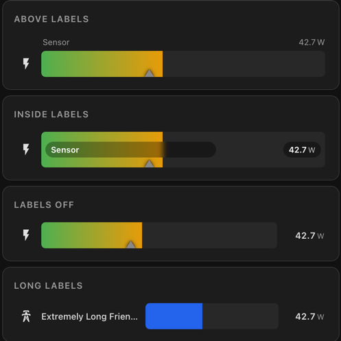

> *My first ever Home Assistant card — please open an issue if you find bugs or have feature requests!*

---

## Features

- 🎨 **Three colour modes** — smooth gradient (with custom stop colours), severity bands, or a single fixed colour
- 📍 **Four label positions** — left, above, inside the bar, or off
- 📈 **Optional peak marker** — a compact top-edge reference marker showing the highest value seen this session
- 🎯 **Optional target marker** — a compact bottom-edge reference marker showing a configurable goal or threshold
-  🚨 **Optional above-target color** — highlight the filled bar segment beyond the target with a separate color
-  🔄 **Dynamic min/max/target support** — optionally source `min`, `max`, and `target` from other entity states
-  🏷️ **Optional target value label** — show the target value below the marker
-  ↔️ **Responsive label alignment** — above labels and target labels stay aligned during resize and zoom
- ✨ **Animated fill** — smooth bar width and colour transitions on value change
- 🖱️ **Native HA entity dialog** — click any bar to open the Home Assistant more-info popup with history
- 🔧 **Per-entity overrides** — every option can be set as a global default and overridden per entity
- 📐 **Configurable bar height** — set different heights per entity or globally
- 🔢 **Decimal places** — control how many decimal places are shown in the value
- 🔇 **Icon control** — use the entity's built-in HA icon, specify your own, or hide it entirely
- 🏷️ **Unit override** — display any unit regardless of what the sensor reports
- 🌡️ **Works with any sensor** — power, temperature, humidity, battery, CO₂, water flow, and more

---

## Installation

 labels in this README mark features that are specific to Sensor Bar Card Plus and are not part of the original upstream card.

### HACS (Recommended)

1. Open **HACS** in Home Assistant
2. Click the three dots (⋮) in the top right → **Custom repositories**
3. Add `https://github.com/cdelaet/sensor-bar-card-plus` and select **Dashboard** as the category
4. Click **Add**
5. Search for **Sensor Bar Card Plus** and click **Download**
6. Hard refresh your browser (Ctrl+Shift+R)

### Manual

1. Download `sensor-bar-card-plus.js` from the [latest release](https://github.com/cdelaet/sensor-bar-card-plus/releases/latest)
2. Copy it to your Home Assistant `/config/www/` folder
3. Go to **Settings → Dashboards → Resources** and add:
   - URL: `/local/sensor-bar-card-plus.js`
   - Type: `JavaScript Module`
4. Hard refresh your browser (Ctrl+Shift+R)

### Migrating From The Original Card

If you already use the original project, this fork can be installed side-by-side. Update your dashboard configuration from `custom:sensor-bar-card` to `custom:sensor-bar-card-plus`, and update the resource URL to `/local/sensor-bar-card-plus.js`.

---

## Demo Playground

The repository includes a self-contained Home Assistant playground for testing, screenshots, and contributor debugging:

- dashboard YAML: `examples/dashboards/sensor-bar-card-plus-playground.yaml`
- helper + template package: `examples/packages/sensor_bar_card_plus_playground_package.yaml`

The playground exposes helper entities for current value, min/max/target, animation, label mode, color mode, target label, peak display, and stress scenarios. The card itself still consumes normal `sensor.*` entities, so it behaves like a real installation rather than talking directly to helpers.

Use it to verify:

- color modes
- label modes
- dynamic min/max/target entities
- peak and target marker behavior
- edge cases like `unknown`, `unavailable`, and negative values
- responsive rendering and stress layouts

Repository-ready screenshots captured from the screenshot board are stored alongside the existing README images, for example:

- `images/playground-label-modes.png`
- `images/playground-target-markers.png`
- `images/playground-marker-overlap.png`
- `images/playground-stress-markers.png`

---

## Quick Start

```yaml
type: custom:sensor-bar-card-plus
title: Power Usage
entities:
  - entity: sensor.kettle_power
    name: Kettle
    icon: mdi:kettle
    max: 3000
```

---

## Configuration

All options can be set at the **card level as global defaults** and overridden individually per entity.

### Card Options

| Option | Type | Default | Description |  |
|---|---|---|---|---|
| `title` | string | — | Optional title shown above the bars | - |
| `entities` | list | **required** | List of entities to display | - | 
| `label_position` | string | `left` | Label position — `left` \| `above` \| `inside` \| `off` | - |
| `color_mode` | string | `severity` | Bar colour mode — `gradient` \| `severity` \| `single` | - |
| `color` | string | `#4a9eff` | Bar colour when `color_mode: single` | - |
| `gradient_stops` | list | green/orange/red | Custom gradient stop colours and positions — see [Gradient](#gradient) | - |
| `severity` | list | green/orange/red | Colour bands — see [Severity](#severity-options) | - |
| `animated` | boolean | `true` | Smooth bar width and colour transitions | - |
| `show_peak` | boolean | `false` | Show peak marker for the highest value seen this session | - |
| `peak_color` | string | `#888` | Colour of the peak marker | - |
| `target` | number | — | Fixed target marker value (same scale as `min`/`max`) | - |
| `target_entity` | string | — | Entity whose numeric state is used as the target marker value |  |
| `target_color` | string | `#888` | Colour of the target marker | - |
| `above_target_color` | string | — | Colour used for the filled portion of the bar beyond the target |  |
| `show_target_label` | boolean | `false` | Show the target value as a label below the target marker |  |
| `decimal` | number | — | Decimal places to show in the value (e.g. `0`, `1`, `2`) | - |
| `min` | number | `0` | Minimum value (shown as 0% bar width) | - |
| `min_entity` | string | — | Entity whose numeric state is used as the minimum value |  |
| `max` | number | `100` | Maximum value (shown as 100% bar width) | - |
| `max_entity` | string | — | Entity whose numeric state is used as the maximum value |  |
| `height` | number | `38` | Bar height in pixels | - |
| `label_width` | number | `100` | Width of the name label column in pixels — only applies when `label_position: left` | - |
| `unit` | string | — | Override the unit of measurement displayed next to the value | - |

### Entity Options

Each item in `entities` accepts all card-level options above as overrides, plus:

| Option | Type | Description |
|---|---|---|
| `entity` | string | **Required.** The Home Assistant entity ID |
| `name` | string | Display name — defaults to the entity's friendly name |
| `icon` | string / `false` | MDI icon e.g. `mdi:thermometer`, or `false` to hide the icon entirely |

---

## Colour Modes

### `gradient`
Smoothly blends the bar colour from green → orange → red as the value rises from `min` to `max`. No extra configuration needed — or supply your own `gradient_stops` to use any colours you like.

Each stop takes a `color` (hex) and a `pos` (0–100). Stops are sorted by position automatically, and at least two are required.

```yaml
color_mode: gradient

# Optional — override the default green/orange/red
gradient_stops:
  - pos: 0
    color: '#4a9eff'
  - pos: 50
    color: '#9c27b0'
  - pos: 100
    color: '#e91e63'
```

### `severity`
Defines hard colour bands using `from` and `to` percentage values (0–100, relative to `min`/`max`):

```yaml
color_mode: severity
severity:
  - from: 0
    to: 33
    color: '#4CAF50'
  - from: 33
    to: 75
    color: '#FF9800'
  - from: 75
    to: 100
    color: '#F44336'
```

### `single`
A single fixed colour for the bar regardless of value:

```yaml
color_mode: single
color: '#4a9eff'
```

---

## Label Positions

| Value | Description |
|---|---|
| `left` | Name fixed on the left, value on the right — all bars start at the same position |
| `above` | Name on the left above the bar, value on the right above the bar, aligned to the bar column |
| `inside` | Name and value rendered inside the bar — best with a taller `height` |
| `off` | No name label — value still shown on the right |

---

## Label Width

When using `label_position: left`, all name labels share a fixed-width column so the bars all start at the same horizontal position. The default width is `100px` — use `label_width` to widen it if your entity names are long, or narrow it for more compact cards. It can be set globally or overridden per entity.

```yaml
type: custom:sensor-bar-card-plus
label_position: left
label_width: 140   # wider column for longer names
entities:
  - entity: sensor.living_room_temperature
    name: Living Room Temp
  - entity: sensor.bedroom_temperature
    name: Bedroom Temp
```

## Icons

Each bar shows an icon to the left of the label. The card resolves which icon to show in this order:

1. If `icon: false` — no icon is shown and no space is reserved
2. If `icon: mdi:something` — that icon is used
3. Otherwise — the entity's own HA icon is used automatically

```yaml
entities:
  - entity: sensor.kettle_power
    name: Kettle
    # no icon set — uses the entity's HA icon automatically

  - entity: sensor.fridge_power
    name: Fridge
    icon: mdi:fridge   # explicit override

  - entity: sensor.solar_power
    name: Solar
    icon: false        # no icon, no gap
```

---

## Peak Marker

When `show_peak: true` is set, the card tracks the highest value seen since the page was loaded and displays it as a compact top-edge marker on the bar. Use `peak_color` to change the marker colour.

This is useful for catching brief spikes you might otherwise miss, for example a kettle or appliance switching on momentarily.

> **Note:** The peak value resets when the page is reloaded as it is stored in memory only.

---

## Target Marker

When `target` is set to a value, a fixed marker is drawn on the bar at that position as a compact bottom-edge marker. Use `target_color` to change the marker colour.

The target marker sits on the **bottom** edge of the bar while the peak marker sits on the **top** edge, so the two remain easy to distinguish at a glance and can overlap cleanly when needed.

The target value uses the same scale as `min` and `max` — so if `max: 3000` and you want a target at 2000W, set `target: 2000`.


You can also provide `min_entity`, `max_entity`, and `target_entity` to source those values from other Home Assistant entities. If both a constant value and an entity are provided, the entity value takes precedence. If the entity state is unavailable or non-numeric, the card falls back to the constant value.

When `target_entity` changes, the target marker position updates during subsequent renders so it can be used as a dynamic indicator without reloading the dashboard.

Set `show_target_label: true` to display the target value below the marker. The label follows the marker as values update and is automatically clamped so it stays within the bar width, including near the left and right edges.

Set `above_target_color` to give the filled section beyond the target a different color. This only applies when the current value exceeds the target, making it easy to distinguish the portion that is over the goal or threshold.

---

## Unit Override

By default the card displays whatever unit the sensor reports. Use `unit` to override this — useful for shortening long units, normalising mixed sensors, or simply displaying something cleaner.

```yaml
entities:
  - entity: sensor.solar_power
    name: Solar
    unit: W       # override whatever HA reports
  - entity: sensor.daily_energy
    name: Today
    unit: kWh
```

---

## Clicking a Bar

Clicking anywhere on a bar row fires the native Home Assistant `hass-more-info` event for that entity, opening the standard HA popup with full history, attributes, and graphs — exactly the same as tapping an entity in any other HA card.

---

## Error Handling

If an entity ID is not found in Home Assistant (e.g. a typo or a device that's been removed), the card renders a small red error message in place of that bar rather than crashing the whole card. The other entities continue to display normally.

---

## Examples

---

### Dynamic Min / Max / Target Entities


Use entity states to drive the scale and target marker dynamically. This is useful when thresholds or limits are managed elsewhere in Home Assistant.

```yaml
type: custom:sensor-bar-card-plus
entities:
  - entity: sensor.grid_import_qh_projected_end_w
    min: 0
    max_entity: sensor.grid_peak_limit
    target_entity: sensor.grid_peak_warning
```

If both a fixed value and an entity are configured for the same setting, the entity is used. If the entity state is unavailable or non-numeric, the fixed value is used instead.

---

### Basic — Single Sensor

The simplest possible config. One entity, default severity colour mode, label on the left.


```yaml
type: custom:sensor-bar-card-plus
title: Caravan Power
entities:
  - entity: input_number.bar_card_test_power
    name: Caravan
    icon: mdi:caravan
    max: 3000
```

---

### Colour Mode: Gradient

Smooth colour transition as the value rises from `min` to `max`. By default the gradient runs green → orange → red, but you can define your own colours and stop positions using `gradient_stops`. Each stop takes a `color` (any hex colour) and a `pos` (0–100, the percentage point where that colour is anchored).

This example uses a different custom gradient for each sensor type — cool blue for power, warm amber for temperature, ocean tones for humidity, and a traffic-light palette for battery.

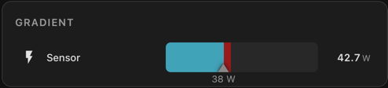

```yaml
type: custom:sensor-bar-card-plus
title: Gradient Colour Mode
color_mode: gradient
label_position: left
entities:
  - entity: input_number.bar_card_test_power
    name: Power
    icon: mdi:lightning-bolt
    min: 0
    max: 3200
  - entity: input_number.bar_card_test_temperature
    name: Temperature
    icon: mdi:thermometer
    min: 0
    max: 40
    gradient_stops:
      - pos: 0
        color: "#33ccff"
      - pos: 50
        color: "#ff9933"
      - pos: 100
        color: "#ff0000"
  - entity: input_number.bar_card_test_humidity
    name: Humidity
    icon: mdi:water-percent
    min: 0
    max: 100
    gradient_stops:
      - pos: 0
        color: "#e0f7fa"
      - pos: 50
        color: "#26c6da"
      - pos: 100
        color: "#006064"
  - entity: input_number.bar_card_test_battery
    name: Battery
    icon: mdi:battery
    min: 0
    max: 100
    gradient_stops:
      - pos: 0
        color: "#F44336"
      - pos: 30
        color: "#FF9800"
      - pos: 60
        color: "#4CAF50"
      - pos: 100
        color: "#4CAF50"
```

---

### Colour Mode: Severity Bands

Hard colour bands that change at defined thresholds. Great for showing clearly when something is in a good, warning, or critical state.

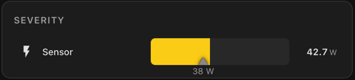

```yaml
type: custom:sensor-bar-card-plus
title: Severity Colour Mode
color_mode: severity
label_position: left
severity:
  - from: 0
    to: 33
    color: "#4CAF50"
  - from: 33
    to: 75
    color: "#FF9800"
  - from: 75
    to: 100
    color: "#F44336"
entities:
  - entity: input_number.bar_card_test_power
    name: Low Usage
    icon: mdi:sine-wave
    max: 3000
  - entity: input_number.bar_card_test_power
    name: Medium Usage
    icon: mdi:sine-wave
    max: 500
  - entity: input_number.bar_card_test_power
    name: High Usage
    icon: mdi:sine-wave
    max: 150
```

---

### Colour Mode: Single Colour

One fixed colour for all bars regardless of value. Good for battery levels or any sensor where you just want clean consistent styling.

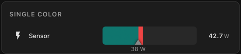

```yaml
type: custom:sensor-bar-card-plus
title: Single Colour Mode
label_position: left
entities:
  - entity: input_number.bar_card_test_power
    name: Blue
    icon: mdi:sine-wave
    max: 3000
    color_mode: single
    color: "#4a9eff"
  - entity: input_number.bar_card_test_power
    name: Green
    icon: mdi:sine-wave
    max: 3000
    color_mode: single
    color: "#4CAF50"
  - entity: input_number.bar_card_test_power
    name: Purple
    icon: mdi:sine-wave
    max: 3000
    color_mode: single
    color: "#9c27b0"
```

---

### Label Position: Left (Default)

Name fixed-width on the left, value on the right. All bars start at the same horizontal position regardless of name length — the best choice when displaying multiple sensors together.

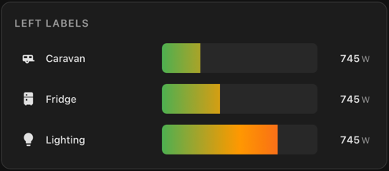

```yaml
type: custom:sensor-bar-card-plus
title: Label Position — Left
label_position: left
entities:
  - entity: input_number.bar_card_test_power
    name: Caravan
    icon: mdi:caravan
    max: 3000
  - entity: input_number.bar_card_test_power
    name: Fridge
    icon: mdi:fridge
    max: 2000
  - entity: input_number.bar_card_test_power
    name: Lighting
    icon: mdi:lightbulb
    max: 1000
```

---

### Label Position: Above

Name and value shown above the bar. Good when you want more vertical breathing room between rows. The above-line layout stays aligned with the bar column, so icon presence, browser zoom, and resizing do not shift it out of place.

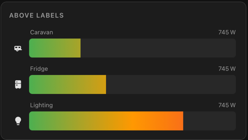

```yaml
type: custom:sensor-bar-card-plus
title: Label Position — Above
label_position: above
entities:
  - entity: input_number.bar_card_test_power
    name: Caravan
    icon: mdi:caravan
    max: 3000
  - entity: input_number.bar_card_test_power
    name: Fridge
    icon: mdi:fridge
    max: 2000
```

---

### Label Position: Inside

Name and value rendered inside the bar itself. Works best with a taller bar height.

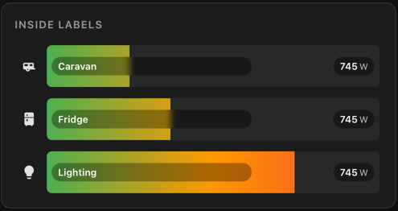

```yaml
type: custom:sensor-bar-card-plus
title: Label Position — Inside
label_position: inside
height: 48
entities:
  - entity: input_number.bar_card_test_power
    name: Caravan
    icon: mdi:caravan
    max: 3000
  - entity: input_number.bar_card_test_power
    name: Fridge
    icon: mdi:fridge
    max: 1000
```

---

### Label Position: Off

No name label at all — value still shows on the right. Useful for very compact dashboards or when the card title is sufficient context.

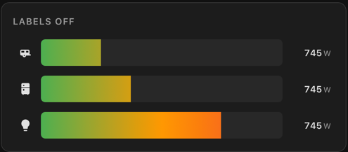

```yaml
type: custom:sensor-bar-card-plus
title: Label Position — Off
label_position: "off"
entities:
  - entity: input_number.bar_card_test_power
    icon: mdi:caravan
    max: 3000
  - entity: input_number.bar_card_test_power
    icon: mdi:fridge
    max: 2000
  - entity: input_number.bar_card_test_power
    icon: mdi:lightbulb
    max: 1000
```

---

### Label Width

Override the default label width.


```yaml
type: custom:sensor-bar-card-plus
title: Label Widths
label_position: left
color_mode: single
color: "#4a9eff"
max: 3000
entities:
  - entity: input_number.bar_card_test_power
    name: Label
    label_width: 35
  - entity: input_number.bar_card_test_power
    name: Label
    label_width: 75
  - entity: input_number.bar_card_test_power
    name: Label
```

---

### Peak Marker

When `show_peak: true`, a compact top-edge marker marks the highest value seen since the page loaded. Use `peak_color` to choose a colour — defaults to grey.


```yaml
type: custom:sensor-bar-card-plus
title: Peak Marker
label_position: left
show_peak: true
entities:
  - entity: input_number.bar_card_test_power
    name: With Peak
    icon: mdi:caravan
    max: 3000
  - entity: input_number.bar_card_test_power
    name: Without Peak
    icon: mdi:caravan
    max: 3000
    show_peak: false
```

---

### Target Marker

A fixed bottom-edge marker showing a goal or threshold. It sits opposite the peak marker so the two remain easy to distinguish even when they are close together. Use `target_color` to choose a colour — defaults to grey.


```yaml
type: custom:sensor-bar-card-plus
title: Target Marker
label_position: left
entities:
  - entity: input_number.bar_card_test_power
    name: Green Target
    icon: mdi:target
    min: 0
    max: 3000
    target: 2000
    target_color: "#4CAF50"
  - entity: input_number.bar_card_test_power
    name: Red Target
    icon: mdi:target
    min: 0
    max: 3000
    target: 2000
    target_color: "#F44336"
  - entity: input_number.bar_card_test_power
    name: Default Color
    icon: mdi:target
    min: 0
    max: 3000
    target: 2000
```

---

### Target Marker With Value Label


Enable `show_target_label` to render the target value below the marker. The label stays attached to the marker during updates and remains within the bar bounds when the card is narrow or the target is close to either edge.

```yaml
type: custom:sensor-bar-card-plus
title: Target Marker Label
label_position: left
entities:
  - entity: input_number.bar_card_test_power
    name: Caravan
    icon: mdi:target
    min: 0
    max: 3000
    target: 2600
    target_color: "#4a9eff"
    show_target_label: true
  - entity: input_number.bar_card_test_power
    name: Fridge
    icon: mdi:target
    min: 0
    max: 1000
    target: 150
    target_color: "#4CAF50"
    show_target_label: true
```

---

### Above-Target Color


Use `above_target_color` to highlight only the part of the filled bar that extends beyond the target marker. This is useful when you want the normal range to keep its existing bar color while clearly calling out the exceeded portion.

```yaml
type: custom:sensor-bar-card-plus
title: Above Target Highlight
label_position: left
entities:
  - entity: input_number.bar_card_test_power
    name: Grid Import
    icon: mdi:transmission-tower-import
    min: 0
    max: 3000
    target: 2000
    target_color: "#4a9eff"
    above_target_color: "#F44336"
    show_target_label: true
  - entity: input_number.bar_card_test_power
    name: Solar Export
    icon: mdi:solar-power
    min: 0
    max: 3000
    target: 1200
    target_color: "#FF9800"
    above_target_color: "#FF66AA"
```

---

### Peak & Target Together

Peak (top edge) and target (bottom edge) on the same bar. Peak tracks the session high while target marks your goal — both independently coloured so they're always easy to tell apart.

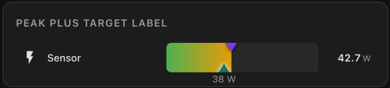

```yaml
type: custom:sensor-bar-card-plus
title: Peak & Target
label_position: left
show_peak: true
peak_color: "#F44336"
entities:
  - entity: input_number.bar_card_test_power
    name: Caravan
    icon: mdi:caravan
    min: 0
    max: 3200
    target: 2000
    target_color: "#4a9eff"
  - entity: input_number.bar_card_test_power
    name: Fridge
    icon: mdi:fridge
    min: 0
    max: 3200
    target: 500
    target_color: "#4CAF50"
    peak_color: "#FF9800"
```

---

### Decimal Places

Control how many decimal places are shown in the value. Useful for tidying up temperature, humidity, or any sensor that reports many decimal places by default.


```yaml
type: custom:sensor-bar-card-plus
title: Decimal Places
label_position: left
min: 0
max: 40
label_width: 140
entities:
  - entity: input_number.bar_card_test_temperature
    name: No decimal (0)
    decimal: 0
  - entity: input_number.bar_card_test_temperature
    name: One decimal (1)
    decimal: 1
  - entity: input_number.bar_card_test_temperature
    name: Two decimals (2)
    decimal: 2
  - entity: input_number.bar_card_test_temperature
    name: Raw (no decimal set)
```

---

### Hiding Icons

Use `icon: false` to remove the icon and its reserved space entirely. You can mix and match — some rows with icons, some without.

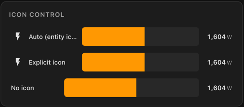

```yaml
type: custom:sensor-bar-card-plus
title: Icon Control
label_position: left
entities:
  - entity: input_number.bar_card_test_power
    name: Auto (entity icon)
    max: 3000
  - entity: input_number.bar_card_test_power
    name: Explicit icon
    icon: mdi:flash
    max: 3000
  - entity: input_number.bar_card_test_power
    name: No icon
    icon: false
    max: 3000
```

---

### Bar Height Variations

Adjust `height` to make bars taller or more compact. Can be set globally or per entity.


```yaml
type: custom:sensor-bar-card-plus
title: Bar Heights
label_position: left
entities:
  - entity: input_number.bar_card_test_power
    name: 24px Compact
    icon: mdi:minus
    max: 3000
    height: 24
  - entity: input_number.bar_card_test_power
    name: Default (38px)
    icon: mdi:minus
    max: 3000
  - entity: input_number.bar_card_test_power
    name: 52px Tall
    icon: mdi:minus
    max: 3000
    height: 52
  - entity: input_number.bar_card_test_power
    name: 70px Taller
    icon: mdi:minus
    max: 3000
    height: 70
```

---

### Per-Entity Overrides

Every global option can be overridden per entity. This example uses a global gradient, but overrides the colour mode, height, and label position individually on some entities.

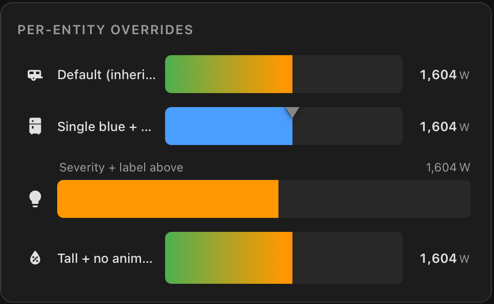

```yaml
type: custom:sensor-bar-card-plus
title: Per-Entity Overrides
color_mode: gradient
label_position: left
animated: true
show_peak: false
entities:
  - entity: input_number.bar_card_test_power
    name: Default (inherits all globals)
    icon: mdi:caravan
    max: 3000
  - entity: input_number.bar_card_test_power
    name: Single blue + peak on
    icon: mdi:fridge
    max: 3000
    color_mode: single
    color: "#4a9eff"
    show_peak: true
  - entity: input_number.bar_card_test_power
    name: Severity + label above
    icon: mdi:lightbulb
    max: 3000
    color_mode: severity
    label_position: above
    severity:
      - from: 0
        to: 33
        color: "#4CAF50"
      - from: 33
        to: 75
        color: "#FF9800"
      - from: 75
        to: 100
        color: "#F44336"
  - entity: input_number.bar_card_test_power
    name: Tall + inside label
    icon: mdi:television
    max: 3000
    height: 30
    label_position: inside
  - entity: input_number.bar_card_test_temperature
    name: Living Room
    icon: mdi:sofa
    label_width: 80
  - entity: input_number.bar_card_test_temperature
    name: Living Room
    label_position: above
    icon: false
    label_width: 80
```

---

## Future Features

A few ideas that have been discussed and are on the roadmap — no timeline, but watch this space:

- **UI / Visual editor** — configure the card through the HA dashboard UI instead of YAML, with dropdowns, toggles, and an entity picker
- **`tap_action` / `hold_action`** — configurable actions on click, matching the standard HA action model used by other cards
- **`attribute` support** — display a specific entity attribute instead of the main state value
- **Reverse / RTL bars** — fill from right to left for sensors where low values should appear full (e.g. remaining capacity)
- **Min / max labels** — optional labels at each end of the bar track showing the configured min and max values

---

## Contributing

Pull requests and issues are welcome! Please open an issue before submitting major changes.

1. Fork the repository
2. Make your changes to `dist/sensor-bar-card-plus.js`
3. Test in Home Assistant
4. Open a pull request

---

## Support

If this card saves you some time and you'd like to say thanks, a coffee is always appreciated!

[](https://buymeacoffee.com/tommysharpnz)

---

## License

[MIT](LICENSE)
