# Sensor Bar Card Plus

[](https://github.com/hacs/integration)
[](https://github.com/cdelaet/sensor-bar-card-plus/releases)
[](https://github.com/cdelaet/sensor-bar-card-plus/actions/workflows/validate.yml)
[](https://github.com/cdelaet/sensor-bar-card-plus/blob/main/LICENSE)
[](https://github.com/cdelaet/sensor-bar-card-plus)

A modern sensor visualization card for Home Assistant dashboards, with dynamic min/max/target sources, flexible bar rendering, severity-aware coloring, target and peak markers, and compact information-dense layouts.

It is built for dashboards where the visual context should follow live Home Assistant data instead of staying hardcoded. Sensor Bar Card Plus works well for power, temperature, humidity, battery, CO2, water flow, response times, quotas, and other numeric sensors, while still fitting cleanly into modern Lovelace layouts with smooth rendering and responsive label behavior.

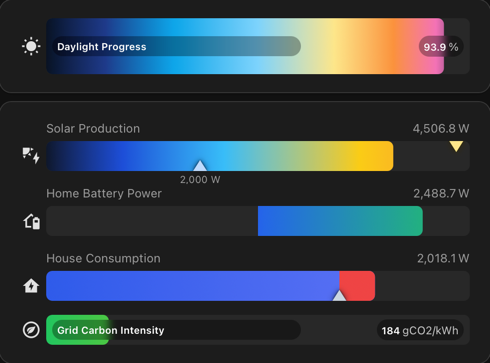


[](https://ko-fi.com/chrisdelaet)

## Highlights

- 📈 **Dynamic min / max / target entities** for data-driven scales and references
- ⚖️ **Baseline fill origin** for bidirectional flows such as charge/discharge and import/export (NEW)
- ✏️ **Target and peak markers** with optional target value labels
- 🌈 **Severity gradient and severity-based coloring** with `gradient`, `severity`, `single`, and `severity_gradient`
- 🎯 **Above-target color** for visually separating the portion beyond a live or fixed threshold
- 📍 **Inline / inside / above / left label placement** with `left`, `above`, `inside`, and `off`
- 🏷️ **Responsive label and marker layout** for tighter dashboard spaces
- 🔧 **Per-entity overrides** for nearly every card option
- 🎞️ **Smooth semantic animations** for gradients, severity bands, and threshold overlays
- 🖱️ **Native Home Assistant more-info dialog** on click

## Installation

### HACS

[](https://my.home-assistant.io/redirect/hacs_repository/?owner=cdelaet&repository=sensor-bar-card-plus&category=plugin)

Sensor Bar Card Plus is available through HACS and this is the recommended installation method.

1. Open **HACS** in Home Assistant.
2. Search for **Sensor Bar Card Plus**.
3. Open the card page and choose **Download**.
4. Hard refresh the browser.

### Manual

If you prefer not to use HACS, manual installation is still supported:

1. Download `sensor-bar-card-plus.js` from the [latest release](https://github.com/cdelaet/sensor-bar-card-plus/releases/latest).
2. Copy it to `/config/www/`.
3. Add this resource in **Settings -> Dashboards -> Resources**:

```text
URL: /local/sensor-bar-card-plus.js
Type: JavaScript Module
```

4. Hard refresh the browser.

### Migrating From The Original Card

Install this card side by side, then update:

- resource URL from the original file to `/local/sensor-bar-card-plus.js`
- card type from `custom:sensor-bar-card` to `custom:sensor-bar-card-plus`

## Quick Start

```yaml
type: custom:sensor-bar-card-plus
title: Caravan Power
entities:
  - entity: sensor.caravan_power
    name: Caravan
    icon: mdi:caravan
    min: 0
    max: 3000
```

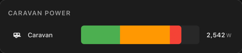

## Demo Assets

The repository includes a full demo playground and a dedicated screenshot board:

- playground dashboard: `examples/dashboards/sensor-bar-card-plus-playground.yaml`
- heritage parity dashboard: `examples/dashboards/sensor-bar-card-plus-heritage.yaml`
- screenshot dashboard: `examples/dashboards/sensor-bar-card-plus-screenshots.yaml`
- helper/template package: `examples/packages/sensor_bar_card_plus_playground_package.yaml`

Use them to validate color modes, markers, dynamic scales, text states, edge cases, and responsive behavior.

## Development / Testing
(NEW)

Install the dev dependencies and Playwright browser once:

```bash
npm install
npx playwright install chromium
```

Run the pure logic unit tests:

```bash
npm run test:unit
```

Run the Playwright visual regression suite:

```bash
npm run test:visual
```

Update the stored visual snapshots intentionally after a reviewed visual change:

```bash
npm run test:visual:update
```

`npm test` runs the unit suite first and then the visual regression suite.

The visual regression suite covers baseline rendering, severity modes, target and peak markers, compact layouts, and clipping or rounded-edge regressions.

## Color Modes

### `gradient`

`gradient` paints a true full-bar gradient across the configured scale.

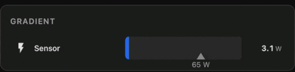

```yaml
type: custom:sensor-bar-card-plus
title: Gradient
color_mode: gradient
gradient_stops:
  - pos: 0
    color: '#2563eb'
  - pos: 50
    color: '#06b6d4'
  - pos: 100
    color: '#ef4444'
entities:
  - entity: sensor.power_usage
    name: Sensor
    min: 0
    max: 100
```

### `severity`

`severity` paints fixed color bands exactly as configured.

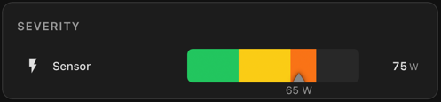

```yaml
type: custom:sensor-bar-card-plus
title: Severity
color_mode: severity
label_position: left
label_width: 160
target: 65
show_target_label: true
severity:
  - from: 0
    to: 30
    color: '#22c55e'
  - from: 30
    to: 60
    color: '#facc15'
  - from: 60
    to: 85
    color: '#f97316'
  - from: 85
    to: 100
    color: '#ef4444'
entities:
  - entity: sensor.power_usage
    name: Sensor
    min: 0
    max: 100
```

### `severity_gradient` 

`severity_gradient` uses the same `severity:` definition, but blends smoothly between the configured colors instead of painting hard bands.

Anchor model:

- first band color is exact at the first band `from`
- last band color is exact at the last band `to`
- intermediate band colors are exact at the midpoint of their band

This makes the mode feel intuitive while still respecting the configured severity ranges.

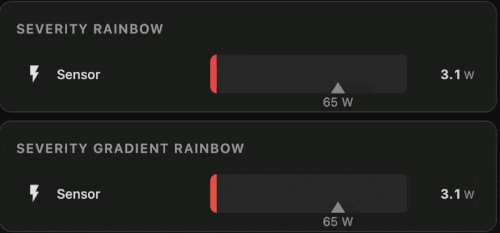

```yaml
type: custom:sensor-bar-card-plus
title: Severity Gradient Rainbow
color_mode: severity_gradient
severity:
  - from: 0
    to: 20
    color: '#22c55e'
  - from: 20
    to: 35
    color: '#84cc16'
  - from: 35
    to: 50
    color: '#eab308'
  - from: 50
    to: 65
    color: '#f59e0b'
  - from: 65
    to: 80
    color: '#f97316'
  - from: 80
    to: 100
    color: '#ef4444'
entities:
  - entity: sensor.power_usage
    name: Sensor
    min: 0
    max: 100
```

### Migrating From Legacy Severity To Structured Segments

Legacy `severity` uses percentage-space semantics, not absolute scale values.

So this:

```yaml
severity:
  - from: 0
    to: 50
    color: '#22c55e'
  - from: 50
    to: 100
    color: '#ef4444'
```

should usually become:

```yaml
bar:
  segments:
    - from: 0%
      to: 50%
      color: '#22c55e'
    - from: 50%
      to: 100%
      color: '#ef4444'
```

not:

```yaml
bar:
  segments:
    - from: 0
      to: 50
      color: '#22c55e'
```

unless you intentionally want scale-space semantics.

Structured segments support both:

- numeric values such as `from: 50` for actual scale values
- percentage strings such as `from: 50%` for percentages of the active scale

Example:

```yaml
type: custom:sensor-bar-card-plus
scale:
  min:
    fixed: -100
  max:
    fixed: 100
bar:
  color_mode: severity
  segments:
    - from: 0%
      to: 50%
      color: '#2563eb'
    - from: 50%
      to: 100%
      color: '#22c55e'
entities:
  - entity: sensor.power_usage
    name: Sensor
```

In that example, `0%..50%` spans the lower half of the active scale regardless of the actual numeric range.

### `single`

`single` uses one fixed fill color regardless of value.

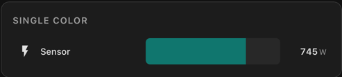

```yaml
type: custom:sensor-bar-card-plus
title: Single Color
color_mode: single
color: '#14b8a6'
entities:
  - entity: sensor.power_usage
    name: Sensor
    min: 0
    max: 100
```

## Label Positions

Supported values:

- `left`
- `above`
- `inside`
- `off`

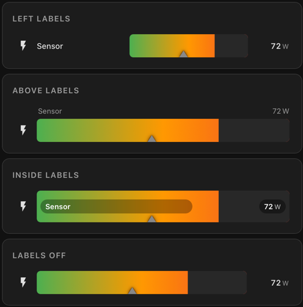

```yaml
type: custom:sensor-bar-card-plus
title: Left Labels
label_position: left
color_mode: gradient
target: 65
entities:
  - entity: sensor.power_usage
    name: Sensor
    icon: mdi:lightning-bolt
    min: 0
    max: 100
```

The screenshot uses this same single sensor in four separate cards, changing only:

- `label_position: left`
- `label_position: above`
- `label_position: inside`
- `label_position: off`

## Label Width

When `label_position: left` is used, all names share a fixed label column so the bars line up cleanly. The default width is `100px`, but you can override it globally or per entity.


```yaml
type: custom:sensor-bar-card-plus
title: Label Width
label_position: left
color_mode: single
color: '#4a9eff'
max: 3000
entities:
  - entity: sensor.power_usage
    name: Label
    label_width: 35
  - entity: sensor.power_usage
    name: Label
    label_width: 75
  - entity: sensor.power_usage
    name: Label
```

## Icons

Each row resolves its icon in this order:

1. `icon: false` hides the icon and removes its reserved space
2. `icon: mdi:something` uses that explicit icon
3. otherwise the card uses the entity's own Home Assistant icon

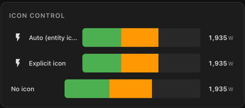

```yaml
type: custom:sensor-bar-card-plus
title: Icon Control
label_position: left
max: 3000
entities:
  - entity: sensor.power_usage
    name: Auto (entity icon)
  - entity: sensor.power_usage
    name: Explicit icon
    icon: mdi:flash
  - entity: sensor.power_usage
    name: No icon
    icon: false
```

## Target, Peak, And Dynamic References

The card supports:

- fixed `target`
- dynamic `target_entity`
- optional `show_target_label`
- optional `above_target_color`
- optional `show_peak`

The target marker sits on the bottom edge of the bar. The peak marker sits on the top edge. They coexist cleanly and can overlap at the same position without fighting for visibility.

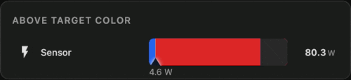

### Above-target color 

Use `above_target_color` when you want the filled section beyond the target to stand out as a different state. The marker, target label, and color split animate together so the threshold remains readable while the target changes.

```yaml
type: custom:sensor-bar-card-plus
title: Above Target Color
color_mode: gradient
target_entity: sensor.power_target
target_color: '#9ca3af'
show_target_label: true
above_target_color: '#dc2626'
entities:
  - entity: sensor.power_usage
    name: Sensor
    icon: mdi:lightning-bolt
    min: 0
    max: 100
```

### Target value label

Set `show_target_label: true` to render the numeric target below the marker. The label is clamped so it stays inside the track area near the edges and follows dynamic target changes smoothly.

### Peak marker example


```yaml
type: custom:sensor-bar-card-plus
title: Peak Marker
label_position: left
show_peak: true
entities:
  - entity: sensor.caravan_power
    name: Caravan
    icon: mdi:caravan
    min: 0
    max: 3000
```

### Target marker example

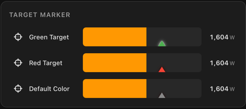

```yaml
type: custom:sensor-bar-card-plus
title: Target Marker
label_position: left
target: 2000
target_color: '#9ca3af'
entities:
  - entity: sensor.caravan_power
    name: Caravan
    icon: mdi:caravan
    min: 0
    max: 3000
```

### Marker coexistence

Peak and target markers can occupy the same position without becoming ambiguous because they live on opposite bar edges. That makes them suitable for shared-threshold visualizations and future multi-reference extensions.

## Baseline Fill Origin 
(NEW))

Use `baseline` when the fill should start from a neutral point instead of always starting at `min`.

- `baseline` defines the fill origin on the configured `min` to `max` scale
- gradients and severity modes still represent the full global scale
- baseline changes fill geometry, not the meaning of the scale
- `baseline.above` and `baseline.below` are optional semantic overlays when you want each side to read differently
- `baseline.at` can use either an absolute scale value or a percentage string such as `50%`

This is useful for batteries, charge and discharge, import and export, neutral operating points, and any bidirectional flow where movement on either side of a reference value should read clearly at a glance.

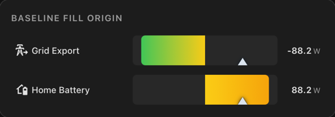

### Structured baseline configuration

These forms are equivalent:

```yaml
baseline: 0
```

```yaml
baseline:
  at:
    fixed: 0
```

And these forms are equivalent:

```yaml
baseline: sensor.dynamic_baseline
```

```yaml
baseline:
  at:
    entity: sensor.dynamic_baseline
```

Advanced baseline behavior is grouped under `baseline:` so related options stay together, the config remains extensible, and the YAML does not drift into flat one-off parameters over time.

### Centered zero baseline

```yaml
type: custom:sensor-bar-card-plus
title: Grid Flow
color_mode: gradient
min: -3000
max: 3000
baseline: 0
entities:
  - entity: sensor.grid_power
    name: Grid
```

### Off-center baseline

```yaml
type: custom:sensor-bar-card-plus
title: Off-center baseline
color_mode: severity_gradient
min: -2000
max: 5000
baseline:
  at: 500
entities:
  - entity: sensor.net_power
    name: Net Power
```

### Baseline colors and overrides

The base semantic scale still spans the full bar. Optional above and below colors sit on top of that scale when you want the two directions to carry distinct meaning.

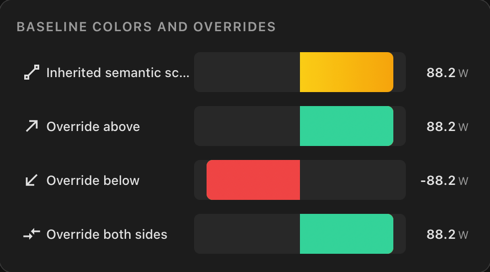

#### Above-baseline color only

```yaml
type: custom:sensor-bar-card-plus
title: Battery Bias
color_mode: gradient
min: -3200
max: 3200
baseline:
  at: 0
  above: '#34d399'
entities:
  - entity: sensor.home_battery_power
    name: Battery
```

#### Above and below baseline colors

```yaml
type: custom:sensor-bar-card-plus
title: Bidirectional Override
color_mode: gradient
min: -3200
max: 3200
baseline:
  at: 0
  above: '#34d399'
  below: '#ef4444'
entities:
  - entity: sensor.home_battery_power
    name: Battery
```

### Target and baseline interaction

Targets stay on the same global scale, so threshold markers, `above_target_color`, and baseline geometry remain easy to read together.

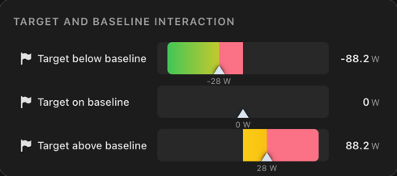

```yaml
type: custom:sensor-bar-card-plus
title: Target And Baseline Interaction
color_mode: severity_gradient
min: -100
max: 100
show_target_label: true
above_target_color: '#fb7185'
baseline:
  at: 0
entities:
  - entity: sensor.power_flow
    name: Target above baseline
    target: 28
```

### Animated semantic baseline

Animated baseline rows keep the semantic color scale stable while the visible interval moves. That makes baseline crossing, threshold transitions, and bidirectional motion much easier to read.


### Dynamic baseline

If both an `entity` and a `fixed` value are set under `baseline.at`, the entity takes precedence. If that entity is unavailable or non-numeric, the `fixed` value is used as fallback.

```yaml
type: custom:sensor-bar-card-plus
title: Dynamic baseline
color_mode: gradient
min: -3000
max: 3000
baseline:
  at:
    entity: sensor.dynamic_baseline
    fixed: 0
entities:
  - entity: sensor.grid_power
    name: Grid
```

### Compact baseline layouts

Baseline also works well in denser dashboard layouts where you still want bidirectional meaning without giving up readability.

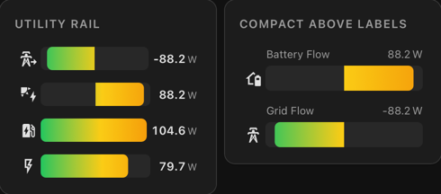

## Dynamic Min / Max / Target Entities

You can source `min`, `max`, and `target` from other entities instead of hardcoding them in the card config.

This is especially useful when the scale and threshold are driven by other helpers, automations, or template sensors.

Why dynamic sources matter: the card can follow real Home Assistant entities for scale and target context instead of baking those values into YAML. That makes the visualization adapt naturally to batteries, grid limits, quotas, thresholds, changing operating modes, and dashboards where the meaning of "full", "safe", or "on target" changes over time.

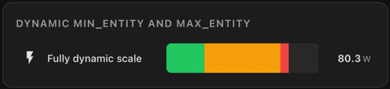

### Dynamic `min_entity` and `max_entity`

```yaml
type: custom:sensor-bar-card-plus
title: Dynamic min_entity and max_entity
color_mode: gradient
min_entity: sensor.dynamic_min
max_entity: sensor.dynamic_max
entities:
  - entity: sensor.live_value
    name: Fully dynamic scale
```

This makes the full bar scale adaptive. The current value stays the same entity, but the visible scale can expand or contract around it.

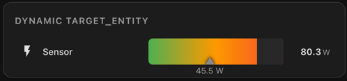

### Dynamic `target_entity`

For a moving threshold, use `target_entity`. This is useful for projected limits, tariff boundaries, ramping goals, or automation-driven targets.

```yaml
type: custom:sensor-bar-card-plus
title: Dynamic target_entity
color_mode: gradient
target_entity: sensor.power_target
show_target_label: true
entities:
  - entity: sensor.power_usage
    name: Sensor
```

Animated example:


If both a fixed value and an entity are configured, the entity takes precedence. If the entity is unavailable or non-numeric, the fixed value is used as fallback.

## Formatting, Text States, And Units

The card handles four related display concerns:

- decimal precision
- unit override
- tight time units like `43s` or `4h`
- textual states such as `unknown`, `unavailable`, and custom text pass-through

### Decimal Precision

Use `decimal` to control how many decimal places are shown per row.

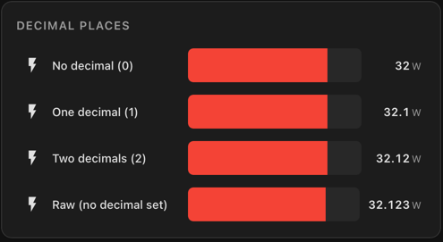

```yaml
type: custom:sensor-bar-card-plus
title: Decimal Places
label_position: left
min: 0
max: 40
label_width: 160
entities:
  - entity: sensor.temperature
    name: No decimal (0)
    decimal: 0
  - entity: sensor.temperature
    name: One decimal (1)
    decimal: 1
  - entity: sensor.temperature
    name: Two decimals (2)
    decimal: 2
  - entity: sensor.temperature
    name: Raw (no decimal set)
```

### Unit Override

By default the card displays the entity's unit of measurement. Use `unit` to override that when you want a shorter, normalized, or more readable display unit.

```yaml
type: custom:sensor-bar-card-plus
entities:
  - entity: sensor.solar_power
    name: Solar
    unit: W
  - entity: sensor.daily_energy
    name: Today
    unit: kWh
```

### Tight Time Units

Time units `h`, `m`, and `s` render tight, for example `43s` and `4h`, instead of showing an extra space.

| Seconds | Hours |
|---|---|
| 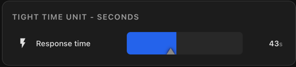 | 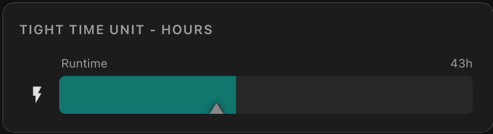 |

```yaml
type: custom:sensor-bar-card-plus
title: Tight Time Unit - Seconds
color_mode: single
color: '#2563eb'
entities:
  - entity: sensor.response_time
    name: Response time
    unit: s
    min: 0
    max: 60
```

### Text States

Non-numeric current states are handled as first-class display states rather than treated like broken numeric rows.

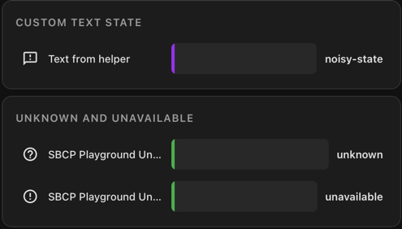

```yaml
type: custom:sensor-bar-card-plus
title: Unknown And Unavailable
color_mode: severity
label_position: left
entities:
  - entity: sensor.status_unknown
    name: Unknown
  - entity: sensor.status_unavailable
    name: Unavailable
```

## Clicking A Bar

Clicking any row opens Home Assistant's native more-info dialog for that entity, including history and attributes.

No extra configuration is required.

## Error Handling

If an entity is missing, unavailable to the card, or misconfigured, the card renders an inline row-level error instead of crashing the whole card.

Other rows continue to render normally.

## Bar Height Variations

Use `height` globally or per entity to make rows more compact or more prominent.

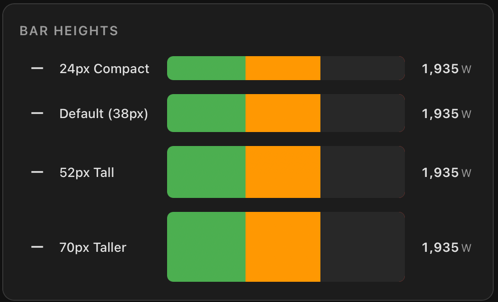

```yaml
type: custom:sensor-bar-card-plus
title: Bar Heights
label_position: left
max: 3000
entities:
  - entity: sensor.power_usage
    name: 24px Compact
    icon: mdi:minus
    height: 24
  - entity: sensor.power_usage
    name: Default (38px)
    icon: mdi:minus
  - entity: sensor.power_usage
    name: 52px Tall
    icon: mdi:minus
    height: 52
  - entity: sensor.power_usage
    name: 70px Taller
    icon: mdi:minus
    height: 70
```

## Per-Entity Overrides

Every card-level option can be overridden per entity.

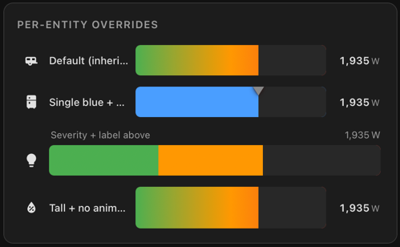

```yaml
type: custom:sensor-bar-card-plus
title: Mixed Overrides
label_position: left
color_mode: gradient
entities:
  - entity: sensor.caravan_power
    name: Caravan
    icon: mdi:caravan
    min: 0
    max: 3000

  - entity: sensor.fridge_power
    name: Fridge
    icon: mdi:fridge
    color_mode: single
    color: '#2563eb'
    min: 0
    max: 2000
    show_peak: true

  - entity: sensor.lighting_power
    name: Lighting
    icon: mdi:lightbulb
    color_mode: severity
    label_position: above
    min: 0
    max: 1000
    severity:
      - from: 0
        to: 40
        color: '#22c55e'
      - from: 40
        to: 75
        color: '#f59e0b'
      - from: 75
        to: 100
        color: '#ef4444'
```

## Configuration Reference

All options can be set globally at card level and overridden per entity.

### Card Options

| Option | Type | Default | Description |
|---|---|---|---|
| `title` | string | - | Optional title above the card |
| `entities` | list | required | Entities to render |
| `label_position` | string | `left` | `left`, `above`, `inside`, `off` |
| `color_mode` | string | `severity` | `gradient`, `severity`, `severity_gradient`, `single` |
| `color` | string | `#4a9eff` | Used by `single` mode |
| `gradient_stops` | list | built-in default | Used by `gradient` |
| `severity` | list | built-in default | Used by `severity` and `severity_gradient` |
| `animated` | boolean | `true` | Animate value changes |
| `show_peak` | boolean | `false` | Show peak marker |
| `peak_color` | string | `#888888` | Peak marker color |
| `target` | number | - | Fixed target value |
| `target_entity` | string | - | Dynamic target value entity |
| `target_color` | string | `#888888` | Target marker color |
| `show_target_label` | boolean | `false` | Show value under target 
| `above_target_color` | string | - | Fill color beyond the target |
| `min` | number | `0` | Minimum scale value |
| `min_entity` | string | - | Dynamic minimum entity |
| `max` | number | `100` | Maximum scale value |
| `max_entity` | string | - | Dynamic maximum entity |
| `baseline` | number, string, object | - | Fill origin config. New in this release. Supports `baseline: 0`, `baseline: sensor.dynamic_baseline`, or a structured object with `at`, `above`, and `below`. |
| `height` | number | `38` | Bar height in pixels |
| `label_width` | number | `100` | Fixed label width for `left` mode |
| `decimal` | number | auto | Decimal places |
| `unit` | string | entity unit | Unit override |

### Entity Options

Each entry in `entities` accepts the card-level options above plus:

| Option | Type | Description |
|---|---|---|
| `entity` | string | Required Home Assistant entity ID |
| `name` | string | Optional display name |
| `icon` | string / `false` | MDI icon override or `false` to hide the icon |

## Behavior Notes

- Clicking a row opens the native Home Assistant more-info dialog.
- Peak values are stored in memory and reset when the page reloads.
- Textual states do not show leftover units.
- Time units `h`, `m`, and `s` render tight, for example `43s` and `4h`.
- Responsive fallbacks preserve readability instead of letting labels and values collide.

## Project Origin

Sensor Bar Card Plus was originally inspired by Sensor Bar Card by TommySharpNZ. The original project is here:

<https://github.com/TommySharpNZ/sensor-bar-card>

This project uses its own resource path and card type so both cards can coexist safely in the same Home Assistant installation:

- original card type: `custom:sensor-bar-card`
- this card type: `custom:sensor-bar-card-plus`
- this resource path: `/local/sensor-bar-card-plus.js`

It is not a drop-in replacement for the original card.

## What This Project Adds

Compared to the original card, Sensor Bar Card Plus adds or reworks:

- layout refactor for consistent bar alignment and more truthful row geometry
- responsive label/value fallback behavior during resize, zoom, and cramped widths
- dynamic `min_entity`, `max_entity`, and `target_entity`
- target marker, target value label, and above-target color highlighting
- synchronized target animation so marker, label, and above-target split move together
- `severity_gradient` as a separate color mode, alongside proper fixed-band `severity`
- stable animated color scales so severity bands and target thresholds do not stretch or wobble
- improved marker rendering and marker coexistence
- more robust handling for text states, negative values, unit display, and inside/above/left layout edge cases
- various bug fixes and rendering improvements across responsive behavior, truncation, and value fitting

## Future Directions

Likely future work includes:

- a more general two-marker system instead of hardcoded target/peak semantics
- an optional live value indicator, similar to the core Home Assistant gauge card
- support for alternative marker roles such as valley, second target, or mixed references
- additional UI/editor improvements where practical

## Contributing

Issues and pull requests are welcome.

Recommended workflow:

1. Make changes in `src/sensor-bar-card-plus.js`
2. Verify behavior in the demo playground and screenshot board
3. Update screenshots or README examples if the user-facing behavior changed
4. Open a pull request with a concise explanation of the change

## Support Me

If `sensor-bar-card-plus` improves your Home Assistant dashboard, you can support continued development, maintenance, fixes, documentation, and new features.

[](https://ko-fi.com/chrisdelaet)

## License

[MIT](LICENSE)
