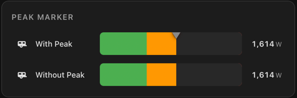

# Sensor Bar Card Plus

[](https://github.com/hacs/integration)
[](https://github.com/cdelaet/sensor-bar-card-plus/releases)
[](LICENSE)

A polished, configurable Lovelace bar card for Home Assistant with responsive layouts, dynamic scale entities, animated target/peak markers, and richer color systems.

Works well for power, temperature, humidity, battery, CO2, water flow, response times, quotas, and any other numeric sensor.


## Why This Fork Exists

This repository is a separate card based on the original project by TommySharpNZ:

- original project: <https://github.com/TommySharpNZ/sensor-bar-card>
- this fork is **not** a drop-in replacement for `custom:sensor-bar-card`
- resource path: `/local/sensor-bar-card-plus.js`
- card type: `custom:sensor-bar-card-plus`

The fork exists to ship additional features and rendering fixes without conflicting with the original card.

## Highlights

- 🎨 **Four color modes**: `gradient`, `severity`, `single`, and  `severity_gradient`
- 📍 **Four label positions**: `left`, `above`, `inside`, and `off`
- 📈 **Peak marker**: top-edge reference marker for the highest seen value in the current session
- 🎯 **Target marker**: bottom-edge reference marker with optional target label
-  **Severity gradient mode**: smooth interpolation using severity ranges as color anchors
-  **Above-target color**: highlight the filled section beyond the target in a different color
-  **Dynamic min / max / target entities**
-  **Target value label**
-  **Responsive label and marker layout**
- ✨ **Smooth animation** with stable color geometry
- 🖱️ **Native Home Assistant more-info dialog** on click
- 🔧 **Per-entity overrides** for nearly every card option

## Installation

 badges in this README mark features that are specific to Sensor Bar Card Plus.

### HACS

1. Open **HACS** in Home Assistant.
2. Go to **Custom repositories**.
3. Add `https://github.com/cdelaet/sensor-bar-card-plus` as a **Dashboard** repository.
4. Install **Sensor Bar Card Plus**.
5. Hard refresh the browser.

### Manual

1. Download `sensor-bar-card-plus.js` from the [latest release](https://github.com/cdelaet/sensor-bar-card-plus/releases/latest).
2. Copy it to `/config/www/`.
3. Add this resource in **Settings -> Dashboards -> Resources**:

```text
URL: /local/sensor-bar-card-plus.js
Type: JavaScript Module
```

4. Hard refresh the browser.

### Migrating From The Original Card

Install this card side by side, then update:

- resource URL from the original file to `/local/sensor-bar-card-plus.js`
- card type from `custom:sensor-bar-card` to `custom:sensor-bar-card-plus`

## Quick Start

```yaml
type: custom:sensor-bar-card-plus
title: Caravan Power
entities:
  - entity: sensor.caravan_power
    name: Caravan
    icon: mdi:caravan
    min: 0
    max: 3000
```

## Demo Assets

The repository includes a full demo playground and a dedicated screenshot board:

- playground dashboard: `examples/dashboards/sensor-bar-card-plus-playground.yaml`
- screenshot dashboard: `examples/dashboards/sensor-bar-card-plus-screenshots.yaml`
- helper/template package: `examples/packages/sensor_bar_card_plus_playground_package.yaml`

Use them to validate color modes, markers, dynamic scales, text states, edge cases, and responsive behavior.

## Color Modes

### `gradient`

`gradient` paints a true full-bar gradient across the configured scale.


```yaml
type: custom:sensor-bar-card-plus
title: Gradient
color_mode: gradient
gradient_stops:
  - pos: 0
    color: '#2563eb'
  - pos: 50
    color: '#06b6d4'
  - pos: 100
    color: '#ef4444'
entities:
  - entity: sensor.power_usage
    name: Sensor
    min: 0
    max: 100
```

### `severity`

`severity` paints fixed color bands exactly as configured.


```yaml
type: custom:sensor-bar-card-plus
title: Severity
color_mode: severity
label_position: left
label_width: 160
target: 65
show_target_label: true
severity:
  - from: 0
    to: 30
    color: '#22c55e'
  - from: 30
    to: 60
    color: '#facc15'
  - from: 60
    to: 85
    color: '#f97316'
  - from: 85
    to: 100
    color: '#ef4444'
entities:
  - entity: sensor.power_usage
    name: Sensor
    min: 0
    max: 100
```

### `severity_gradient` 

`severity_gradient` uses the same `severity:` definition, but blends smoothly between the configured colors instead of painting hard bands.

Anchor model:

- first band color is exact at the first band `from`
- last band color is exact at the last band `to`
- intermediate band colors are exact at the midpoint of their band

This makes the mode feel intuitive while still respecting the configured severity ranges.


```yaml
type: custom:sensor-bar-card-plus
title: Severity Gradient Rainbow
color_mode: severity_gradient
severity:
  - from: 0
    to: 20
    color: '#22c55e'
  - from: 20
    to: 35
    color: '#84cc16'
  - from: 35
    to: 50
    color: '#eab308'
  - from: 50
    to: 65
    color: '#f59e0b'
  - from: 65
    to: 80
    color: '#f97316'
  - from: 80
    to: 100
    color: '#ef4444'
entities:
  - entity: sensor.power_usage
    name: Sensor
    min: 0
    max: 100
```

### `single`

`single` uses one fixed fill color regardless of value.


```yaml
type: custom:sensor-bar-card-plus
title: Single Color
color_mode: single
color: '#14b8a6'
entities:
  - entity: sensor.power_usage
    name: Sensor
    min: 0
    max: 100
```

## Label Positions

Supported values:

- `left`
- `above`
- `inside`
- `off`


```yaml
type: custom:sensor-bar-card-plus
title: Left Labels
label_position: left
color_mode: gradient
target: 65
entities:
  - entity: sensor.power_usage
    name: Sensor
    icon: mdi:lightning-bolt
    min: 0
    max: 100
```

The screenshot uses this same single sensor in four separate cards, changing only:

- `label_position: left`
- `label_position: above`
- `label_position: inside`
- `label_position: off`

## Target, Peak, And Dynamic References

The card supports:

- fixed `target`
- dynamic `target_entity`
- optional `show_target_label`
- optional `above_target_color`
- optional `show_peak`

The target marker sits on the bottom edge of the bar. The peak marker sits on the top edge. They coexist cleanly and can overlap at the same position without fighting for visibility.


```yaml
type: custom:sensor-bar-card-plus
title: Above Target Color
color_mode: gradient
target_entity: sensor.power_target
target_color: '#9ca3af'
show_target_label: true
above_target_color: '#dc2626'
entities:
  - entity: sensor.power_usage
    name: Sensor
    icon: mdi:lightning-bolt
    min: 0
    max: 100
```


### Peak marker example



```yaml
type: custom:sensor-bar-card-plus
title: Peak Marker
label_position: left
entities:
  - entity: sensor.sbcp_screenshot_caravan_power
    name: With Peak
    icon: mdi:caravan
    min: 0
    max: 3000
    show_peak: true
  - entity: sensor.sbcp_screenshot_caravan_power
    name: Without Peak
    icon: mdi:caravan
    min: 0
    max: 3000
    show_peak: false
```

## Dynamic Min / Max / Target Entities


You can source `min`, `max`, and `target` from other entities.

This is especially useful when the scale and threshold are driven by other helpers or template sensors.


```yaml
type: custom:sensor-bar-card-plus
title: Dynamic min_entity and max_entity
color_mode: gradient
min_entity: sensor.dynamic_min
max_entity: sensor.dynamic_max
entities:
  - entity: sensor.live_value
    name: Fully dynamic scale
```

For a moving target, use `target_entity`. The static screenshot shows the layout, and the GIF above shows the target changing over time.


```yaml
type: custom:sensor-bar-card-plus
title: Dynamic target_entity
color_mode: gradient
target_entity: sensor.power_target
show_target_label: true
entities:
  - entity: sensor.power_usage
    name: Sensor
```

Animated example:


If both a fixed value and an entity are configured, the entity takes precedence. If the entity is unavailable or non-numeric, the fixed value is used as fallback.

## Formatting, Text States, And Units

The card handles:

- decimal precision
- unit override
- tight time units like `43s` or `4h`
- textual states such as `unknown`, `unavailable`, and custom text pass-through

| Tight time units | Text states |
|---|---|
| <br> |  |

```yaml
type: custom:sensor-bar-card-plus
title: Tight Time Unit - Seconds
color_mode: single
color: '#2563eb'
entities:
  - entity: sensor.response_time
    name: Response time
    unit: s
    min: 0
    max: 60
```

```yaml
type: custom:sensor-bar-card-plus
title: Unknown And Unavailable
color_mode: severity
label_position: left
entities:
  - entity: sensor.status_unknown
    name: Unknown
  - entity: sensor.status_unavailable
    name: Unavailable
```

## Per-Entity Overrides

Every card-level option can be overridden per entity.

```yaml
type: custom:sensor-bar-card-plus
title: Mixed Overrides
label_position: left
color_mode: gradient
entities:
  - entity: sensor.caravan_power
    name: Caravan
    icon: mdi:caravan
    min: 0
    max: 3000

  - entity: sensor.fridge_power
    name: Fridge
    icon: mdi:fridge
    color_mode: single
    color: '#2563eb'
    min: 0
    max: 2000
    show_peak: true

  - entity: sensor.lighting_power
    name: Lighting
    icon: mdi:lightbulb
    color_mode: severity
    label_position: above
    min: 0
    max: 1000
    severity:
      - from: 0
        to: 40
        color: '#22c55e'
      - from: 40
        to: 75
        color: '#f59e0b'
      - from: 75
        to: 100
        color: '#ef4444'
```

## Configuration Reference

All options can be set globally at card level and overridden per entity.

### Card Options

| Option | Type | Default | Description |  |
|---|---|---|---|---|
| `title` | string | - | Optional title above the card | - |
| `entities` | list | required | Entities to render | - |
| `label_position` | string | `left` | `left`, `above`, `inside`, `off` | - |
| `color_mode` | string | `severity` | `gradient`, `severity`, `severity_gradient`, `single` | - |
| `color` | string | `#4a9eff` | Used by `single` mode | - |
| `gradient_stops` | list | built-in default | Used by `gradient` | - |
| `severity` | list | built-in default | Used by `severity` and `severity_gradient` | - |
| `animated` | boolean | `true` | Animate value changes | - |
| `show_peak` | boolean | `false` | Show peak marker | - |
| `peak_color` | string | `#888` | Peak marker color | - |
| `target` | number | - | Fixed target value | - |
| `target_entity` | string | - | Dynamic target value entity |  |
| `target_color` | string | `#888` | Target marker color | - |
| `show_target_label` | boolean | `false` | Show value under target marker |  |
| `above_target_color` | string | - | Fill color beyond the target |  |
| `min` | number | `0` | Minimum scale value | - |
| `min_entity` | string | - | Dynamic minimum entity |  |
| `max` | number | `100` | Maximum scale value | - |
| `max_entity` | string | - | Dynamic maximum entity |  |
| `height` | number | `38` | Bar height in pixels | - |
| `label_width` | number | `100` | Fixed label width for `left` mode | - |
| `decimal` | number | auto | Decimal places | - |
| `unit` | string | entity unit | Unit override | - |

### Entity Options

Each entry in `entities` accepts the card-level options above plus:

| Option | Type | Description |
|---|---|---|
| `entity` | string | Required Home Assistant entity ID |
| `name` | string | Optional display name |
| `icon` | string / `false` | MDI icon override or `false` to hide the icon |

## Behavior Notes

- Clicking a row opens the native Home Assistant more-info dialog.
- Peak values are stored in memory and reset when the page reloads.
- Textual states do not show leftover units.
- Time units `h`, `m`, and `s` render tight, for example `43s` and `4h`.
- Responsive fallbacks preserve readability instead of letting labels and values collide.

## Origin And Etiquette

This card began as a fork of TommySharpNZ's original Sensor Bar Card. The original project is here:

<https://github.com/TommySharpNZ/sensor-bar-card>

If you want to support the original author:

<https://buymeacoffee.com/tommysharpnz>

This fork intentionally ships under a separate resource path and separate card type so both cards can coexist safely in the same Home Assistant installation.
