<p align="center">
  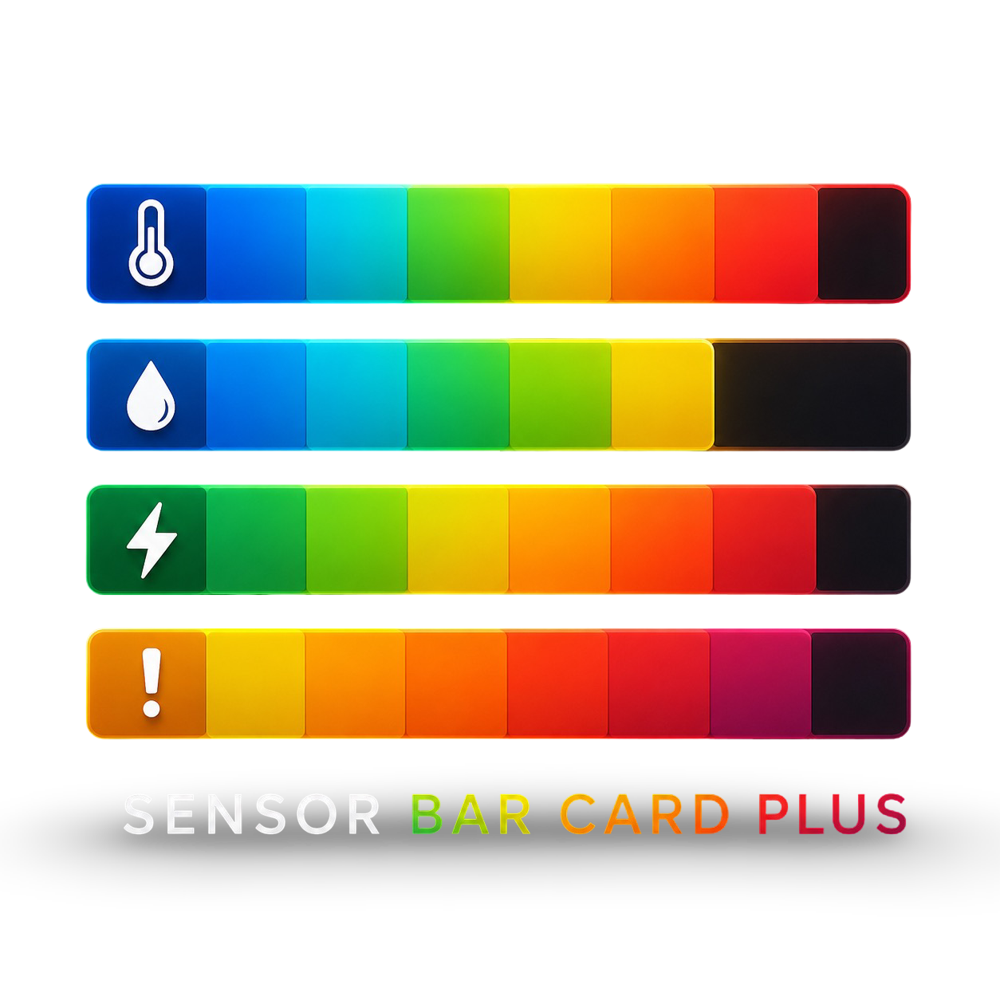
</p>

# Sensor Bar Card Plus

[](https://github.com/hacs/integration)
[](https://github.com/cdelaet/sensor-bar-card-plus/releases)
[](https://github.com/cdelaet/sensor-bar-card-plus/actions/workflows/validate.yml)
[](https://github.com/cdelaet/sensor-bar-card-plus/blob/main/LICENSE)
[](https://github.com/cdelaet/sensor-bar-card-plus)

Sensor Bar Card Plus is a next-generation visualization card for Home Assistant, designed for dashboards where the visual context is just as dynamic as the data itself.

It supports classic reveal-fill bars, baseline-driven bidirectional flows, and full-scale needle gauges. Instead of relying on hardcoded scales and thresholds, the card can derive ranges, targets, baselines, and reference values directly from Home Assistant entities.

Ideal for energy monitoring, batteries, power flows, temperatures, quotas, environmental sensors, gauges, and other numeric data, Sensor Bar Card Plus combines dynamic scales, semantic fills, segment-based coloring, target and peak markers, needle indicators, and responsive layouts into a single highly configurable card.

Now you have no excuse anymore to build that pretty dashboard. Go forth and look cool. -Chris

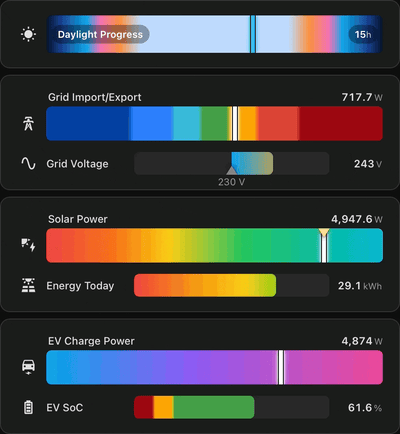


[](https://ko-fi.com/chrisdelaet)

## Highlights

- 📍 Needle gauge mode for full-scale, gauge-style bars with a moving value indicator
- 🌈 Soft bands for segment-aware fills with short blended transitions
- 🎯 Semantic threshold fills for visually separating regions beyond dynamic targets and references (such as an above-target color)
- 📈 Dynamic scales, targets, and references driven by Home Assistant entities
- 🧩 Structured configuration model with full backwards compatibility
- ⚖️ Baseline fill origin for bidirectional flows such as charge/discharge and import/export
- 🎨 Flexible segment-based coloring with scale-space and percent-space thresholds
- ✏️ Target and peak markers with optional target value labels
- 📍 Flexible label placement for compact and information-dense dashboards
- 🏷️ Responsive label and marker layout for tighter dashboard spaces
- 🧠 Deterministic responsive layout engine for narrow dashboards and dense cards
- 🔧 Per-entity overrides for nearly every card option
- 🎞️ Shared animated reveal pipeline for coherent gradients, segments, and semantic fills
- 🖱️ Native Home Assistant more-info dialog on click

## Installation

### HACS

[](https://my.home-assistant.io/redirect/hacs_repository/?owner=cdelaet&repository=sensor-bar-card-plus&category=plugin)

Sensor Bar Card Plus is available through HACS and this is the recommended installation method.

1. Open **HACS** in Home Assistant.
2. Search for **Sensor Bar Card Plus**.
3. Open the card page and choose **Download**.
4. Hard refresh the browser.

### Manual

If you prefer not to use HACS, manual installation is still supported:

1. Download `sensor-bar-card-plus.js` from the [latest release](https://github.com/cdelaet/sensor-bar-card-plus/releases/latest).
2. Copy it to `/config/www/`.
3. Add this resource in **Settings -> Dashboards -> Resources**:

```text
URL: /local/sensor-bar-card-plus.js
Type: JavaScript Module
```

4. Hard refresh the browser.


## Quick Start

```yaml
type: custom:sensor-bar-card-plus
title: Caravan Power
entities:
- entity: sensor.caravan_power
  name: Caravan
  icon: mdi:caravan
scale:
  max:
    fixed: 3000
```


```yaml
type: custom:sensor-bar-card-plus
title: Caravan Power
entities:
- entity: sensor.caravan_power
  name: Caravan
  icon: mdi:caravan
bar:
  needle: true
  fill_style: gradient
scale:
  max:
    fixed: 3000
```

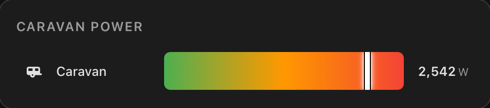


> Legacy flat YAML remains supported. See Legacy Compatibility near the end of this README if you want to migrate older dashboards.


## Rendering Modes

Sensor Bar Card Plus currently supports two primary rendering models:

- reveal fill mode
- needle mode

Both modes share the same semantic fill pipeline, fill styles, dynamic scales, markers, and responsive layout system.

### Reveal Fill Mode

Reveal fill mode is the classic bar behavior. The visible fill grows and shrinks with the current value.

This mode works especially well for:

- progress-style visualizations
- quotas and limits
- batteries
- charge/discharge flows
- import/export power
- bidirectional energy movement

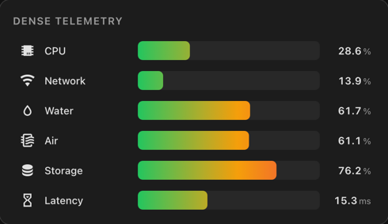

```yaml
type: custom:sensor-bar-card-plus
title: Reveal Fill
bar:
  fill_style: gradient
scale:
  min:
    fixed: 0
  max:
    fixed: 100
entities:
  - entity: sensor.power_usage
    name: Sensor
```

### Reveal Fill With Baseline

Baseline mode extends reveal fill mode by changing the fill origin from `scale.min` to a neutral reference point. The scale itself does not change.

This is useful for visualizing:

- batteries charging/discharging
- import/export flows
- heating/cooling balance
- bidirectional sensors
- centered operating ranges

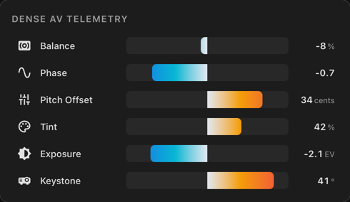


```yaml
type: custom:sensor-bar-card-plus
title: Baseline Flow
bar:
  fill_style: band_gradient
scale:
  min:
    fixed: -3000
  max:
    fixed: 3000
baseline:
  at:
    fixed: 0
entities:
  - entity: sensor.grid_power
    name: Grid
```

### Needle Mode

Needle mode keeps the full theoretical scale visible at all times while a moving needle indicates the current value.

This mode works especially well for:

- gauges
- dashboards with semantic full-scale context
- dynamic scales
- monitoring dashboards
- situations where the full scale meaning matters continuously

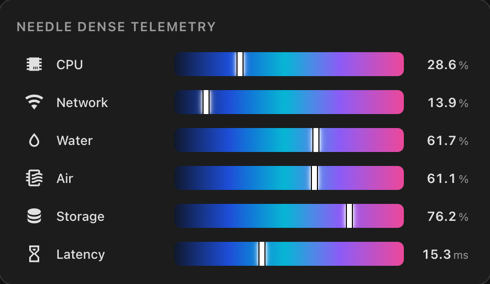


```yaml
type: custom:sensor-bar-card-plus
title: Needle Gauge
bar:
  fill_style: soft_bands
  needle: true
scale:
  min:
    fixed: 0
  max:
    fixed: 100
entities:
  - entity: sensor.power_usage
    name: Sensor
```

The rendering mode determines how the current value is visualized. Fill styles, semantic overlays, markers, targets, peaks, gradients, and responsive behavior work consistently across both rendering models.


## Needle Mode

Needle mode keeps the full theoretical bar paint visible and shows the current value with a moving needle. This makes the card behave more like a gauge while still preserving all of the existing fill logic.

It works with:

- `solid`
- `gradient`
- `bands`
- `soft_bands`
- `band_gradient`
- `solid_fill`

It is especially useful for gauge-style dashboards, dynamic scales, energy flows, and cards where the color context across the whole scale matters as much as the current value itself.

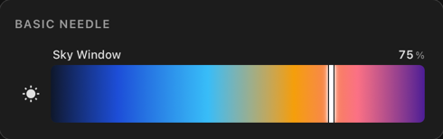

```yaml
type: custom:sensor-bar-card-plus
title: Needle Gauge
bar:
  fill_style: soft_bands
  needle: true
scale:
  min:
    fixed: 0
  max:
    fixed: 100
entities:
  - entity: sensor.power_usage
    name: Sensor
```

Expanded form:

```yaml
bar:
  needle:
    show: true
    color: '#ffffff'
```

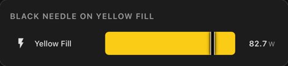

- needle mode and baseline mode are mutually exclusive because baseline visualizes directional fill geometry while needle mode visualizes absolute position on a persistent full-scale track
- target and peak markers render on top of the needle
- inside labels and values render on top of markers and needle
- `bar.needle: true` is the preferred simple syntax for new dashboards

## Fill Styles

Current color_mode compatibility values map directly to these fill styles.

Sensor Bar Card Plus separates semantic fill composition from animated reveal geometry. That is what allows gradients, bands, above-target colors, markers, and animations to stay visually coherent while the bar updates.

### `gradient`

`gradient` paints a true full-bar gradient across the configured scale.

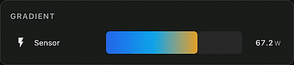

```yaml
type: custom:sensor-bar-card-plus
title: Gradient Fill
bar:
  fill_style: gradient
  gradient_stops:
    - pos: 0
      color: '#2563eb'
    - pos: 50
      color: '#06b6d4'
    - pos: 100
      color: '#ef4444'
scale:
  min:
    fixed: 0
  max:
    fixed: 100
entities:
  - entity: sensor.power_usage
    name: Sensor
```

Needle variant:

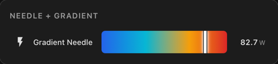

```yaml
bar:
  fill_style: gradient
  needle: true
```

### `bands`

Compatibility name: `severity`

`bands` paints hard bands from `bar.segments`.

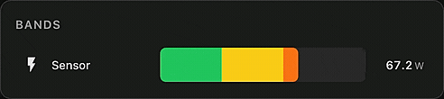

```yaml
type: custom:sensor-bar-card-plus
title: Bands Fill
layout:
  label:
    position: left
    width: 160
bar:
  fill_style: bands
  segments:
    - from: 0%
      to: 30%
      color: '#22c55e'
    - from: 30%
      to: 60%
      color: '#facc15'
    - from: 60%
      to: 85%
      color: '#f97316'
    - from: 85%
      to: 100%
      color: '#ef4444'
scale:
  min:
    fixed: 0
  max:
    fixed: 100
target:
  at:
    fixed: 65
  label:
    show: true
entities:
  - entity: sensor.power_usage
    name: Sensor
```

Needle variant:

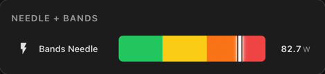


```yaml
bar:
  fill_style: bands
  needle: true
```

### `soft_bands`

`soft_bands` uses the same `bar.segments` configuration as `bands`, but blends each eligible boundary over a short transition zone instead of switching colors abruptly.

It sits between the other segment-based styles:

- `bands`: hard transitions
- `soft_bands`: short blended transitions
- `band_gradient`: continuous gradient derived from segment colors

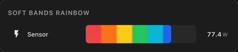

```yaml
type: custom:sensor-bar-card-plus
title: Soft Bands Fill
bar:
  fill_style: soft_bands
  segments:
    - from: 0%
      to: 30%
      color: '#22c55e'
    - from: 30%
      to: 60%
      color: '#facc15'
    - from: 60%
      to: 85%
      color: '#f97316'
    - from: 85%
      to: 100%
      color: '#ef4444'
scale:
  min:
    fixed: 0
  max:
    fixed: 100
entities:
  - entity: sensor.power_usage
    name: Sensor
```

Needle variant:

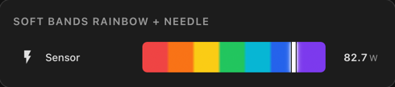

```yaml
bar:
  fill_style: soft_bands
  needle: true
```

### `band_gradient` 

Compatibility name: `severity_gradient` 

`band_gradient` uses the same segment definitions, but renders a continuous gradient derived from those colors instead of painting hard bands.

Anchor model:

- first band color is exact at the first band `from`
- last band color is exact at the last band `to`
- intermediate band colors are exact at the midpoint of their band

This makes the mode feel intuitive while still respecting the configured severity ranges.

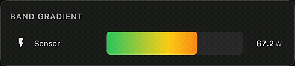

```yaml
type: custom:sensor-bar-card-plus
title: Band Gradient Fill
bar:
  fill_style: band_gradient
  segments:
    - from: 0%
      to: 20%
      color: '#22c55e'
    - from: 20%
      to: 35%
      color: '#84cc16'
    - from: 35%
      to: 50%
      color: '#eab308'
    - from: 50%
      to: 65%
      color: '#f59e0b'
    - from: 65%
      to: 80%
      color: '#f97316'
    - from: 80%
      to: 100%
      color: '#ef4444'
scale:
  min:
    fixed: 0
  max:
    fixed: 100
entities:
  - entity: sensor.power_usage
    name: Sensor
```

Needle variant:

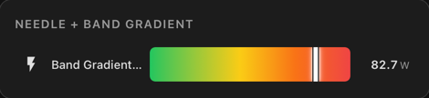


```yaml
bar:
  fill_style: band_gradient
  needle: true
```

### `solid_fill`

`bar.solid_fill: true` samples the theoretical fill color at the current value, then renders the visible fill as one solid color.

This is most useful with `bands`, `band_gradient`, and `gradient` when you want the active color logic without rendering the full multicolor fill across the revealed area.

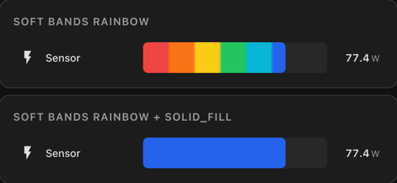


```yaml
type: custom:sensor-bar-card-plus
title: Sampled Solid Fill
bar:
  fill_style: bands
  solid_fill: true
  segments:
    - from: 0%
      to: 50%
      color: '#22c55e'
    - from: 50%
      to: 100%
      color: '#ef4444'
scale:
  min:
    fixed: 0
  max:
    fixed: 100
entities:
  - entity: sensor.power_usage
    name: Sensor
```

With `fill_style: bands`, the active band color is used directly. With `band_gradient` or `gradient`, the color is sampled from the interpolated gradient at the current value. If `solid_fill` is omitted, normal multicolor rendering is unchanged.

The screenshots dashboard includes `Bands Rainbow + solid_fill` and `Band Gradient Rainbow + solid_fill` cards for direct visual comparisons.

Needle variant:

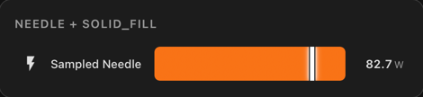


```yaml
bar:
  fill_style: bands
  solid_fill: true
  needle: true
```

### `solid`

Compatibility name: `single` 

`solid` uses one fixed fill color regardless of value.

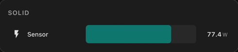

```yaml
type: custom:sensor-bar-card-plus
title: Solid Fill
bar:
  fill_style: solid
  color: '#14b8a6'
scale:
  min:
    fixed: 0
  max:
    fixed: 100
entities:
  - entity: sensor.power_usage
    name: Sensor
```

## Label Positions

Supported values:

- `left`
- `above`
- `inside`
- `off`

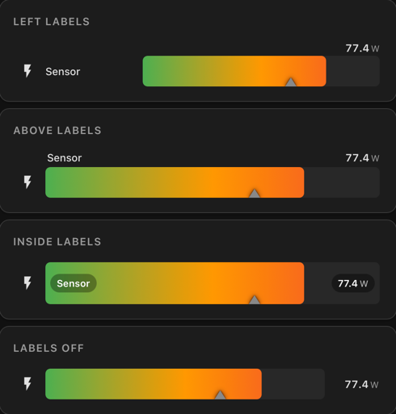

```yaml
type: custom:sensor-bar-card-plus
title: Left Labels
layout:
  label:
    position: left
bar:
  fill_style: gradient
target:
  at:
    fixed: 65
scale:
  min:
    fixed: 0
  max:
    fixed: 100
entities:
  - entity: sensor.power_usage
    name: Sensor
    icon: mdi:lightning-bolt
```

The screenshot uses this same single sensor in four separate cards, changing only:

- `layout.label.position: left`
- `layout.label.position: above`
- `layout.label.position: inside`
- `layout.label.position: off`

### Responsive Behavior

Sensor Bar Card Plus now uses a bar-first responsive layout automatically. In practice, the card protects readability in this order:

- bar readability
- value + unit readability
- icon
- label

Value and unit are treated as one piece of text. They are never split, and the unit is not hidden while the value remains visible.

In tight layouts, left labels may step aside when they no longer fit usefully, the value may move above and to the right of the bar, and the icon may hide as a last resort. Explicit `layout.height` is still respected exactly, while the default row height may shrink automatically in very dense layouts.

There is no YAML option for this yet. The behavior is automatic.

The screenshots dashboard includes dedicated `Responsive Behavior` and `Value + Unit` cards for capture-ready examples.

## Label Width

When `layout.label.position: left` is used, all names share a fixed label column so the bars line up cleanly. The default width is `100px`, but you can override it globally or per entity.

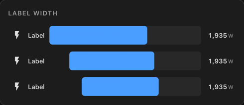

```yaml
type: custom:sensor-bar-card-plus
title: Label Width
layout:
  label:
    position: left
bar:
  fill_style: solid
  color: '#4a9eff'
scale:
  max:
    fixed: 3000
entities:
  - entity: sensor.power_usage
    name: Label
    layout:
      label:
        width: 35
  - entity: sensor.power_usage
    name: Label
    layout:
      label:
        width: 75
  - entity: sensor.power_usage
    name: Label
```

## Icons

Each row resolves its icon in this order:

1. `icon: false` hides the icon and removes its reserved space
2. `icon: mdi:something` uses that explicit icon
3. otherwise the card uses the entity's own Home Assistant icon

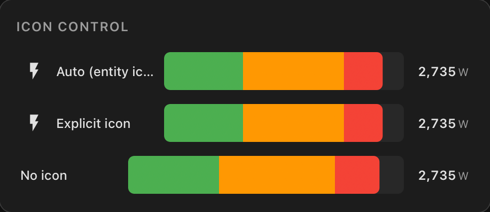

```yaml
type: custom:sensor-bar-card-plus
title: Icon Control
layout:
  label:
    position: left
scale:
  max:
    fixed: 3000
entities:
  - entity: sensor.power_usage
    name: Auto (entity icon)
  - entity: sensor.power_usage
    name: Explicit icon
    icon: mdi:flash
  - entity: sensor.power_usage
    name: No icon
    icon: false
```

## Target, Peak, And Dynamic References

The card supports:

- fixed `target.at.fixed`
- dynamic `target.at.entity`
- percentage-based `target.at: 50%`
- optional `target.label.show`
- optional `target.when_exceeded.fill_color`
- optional `peak.enabled`

The target marker sits on the bottom edge of the bar. The peak marker sits on the top edge. They coexist cleanly and can overlap at the same position without fighting for visibility.

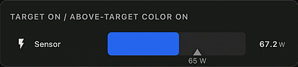

### Above-target color 

Use `target.when_exceeded.fill_color` when you want the filled section beyond the target to stand out as a different semantic state. Sensor Bar Card Plus composes that semantic fill with the normal bar paint, then clips the result with the shared animated reveal front so the marker, target label, and color split stay visually coherent while the target changes.

```yaml
type: custom:sensor-bar-card-plus
title: Above Target Color
bar:
  fill_style: gradient
target:
  at:
    entity: sensor.power_target
  color: '#9ca3af'
  label:
    show: true
  when_exceeded:
    fill_color: '#dc2626'
scale:
  min:
    fixed: 0
  max:
    fixed: 100
entities:
  - entity: sensor.power_usage
    name: Sensor
    icon: mdi:lightning-bolt
```

Needle variant:

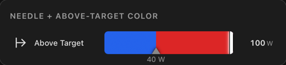


```yaml
bar:
  fill_style: gradient
  needle: true
target:
  when_exceeded:
    fill_color: '#dc2626'
```

### Target value label

Set `target.label.show: true` to render the numeric target below the marker. The label is clamped so it stays inside the track area near the edges and follows dynamic target changes smoothly.

### Peak marker example

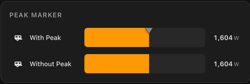

```yaml
type: custom:sensor-bar-card-plus
title: Peak Marker
layout:
  label:
    position: left
peak:
  enabled: true
scale:
  min:
    fixed: 0
  max:
    fixed: 3000
entities:
  - entity: sensor.caravan_power
    name: Caravan
    icon: mdi:caravan
```

### Target marker example

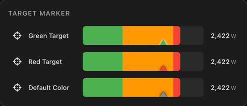

```yaml
type: custom:sensor-bar-card-plus
title: Target Marker
layout:
  label:
    position: left
scale:
  min:
    fixed: 0
  max:
    fixed: 3000
target:
  at:
    fixed: 2000
  color: '#9ca3af'
entities:
  - entity: sensor.caravan_power
    name: Caravan
    icon: mdi:caravan
```

### Marker coexistence

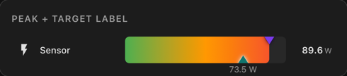

Peak and target markers can occupy the same position without becoming ambiguous because they live on opposite bar edges. That makes them suitable for shared-threshold visualizations and future multi-reference extensions.

## Baseline Fill Origin 

Use `baseline` when the fill should start from a neutral point instead of always starting at `min`.

- `baseline` defines the fill origin on the configured `min` to `max` scale
- gradients and severity modes still represent the full global scale
- baseline changes fill geometry, not the meaning of the scale
- `baseline.above` and `baseline.below` are optional semantic overlays when you want each side to read differently
- `baseline.at` can use either an absolute scale value or a percentage string such as `50%`

This is useful for batteries, charge and discharge, import and export, neutral operating points, and any bidirectional flow where movement on either side of a reference value should read clearly at a glance.

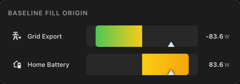

### Structured baseline configuration

Recommended baseline syntax uses the structured form:

```yaml
baseline:
  at:
    fixed: 0
```

Dynamic baselines use the same structure:

```yaml
baseline:
  at:
    entity: sensor.dynamic_baseline
```

Advanced baseline behavior is grouped under `baseline:` so related options stay together, the config remains extensible, and the YAML does not drift into flat one-off parameters over time. Legacy shorthand remains supported and is covered in the migration and legacy reference sections.

### Centered zero baseline

```yaml
type: custom:sensor-bar-card-plus
title: Grid Flow
bar:
  fill_style: gradient
scale:
  min:
    fixed: -3000
  max:
    fixed: 3000
baseline:
  at:
    fixed: 0
entities:
  - entity: sensor.grid_power
    name: Grid
```

### Off-center baseline

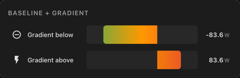

```yaml
type: custom:sensor-bar-card-plus
title: Off-center baseline
bar:
  fill_style: band_gradient
  segments:
    - from: 0%
      to: 30%
      color: '#22c55e'
    - from: 30%
      to: 70%
      color: '#facc15'
    - from: 70%
      to: 100%
      color: '#ef4444'
scale:
  min:
    fixed: -2000
  max:
    fixed: 5000
baseline:
  at:
    fixed: 500
entities:
  - entity: sensor.net_power
    name: Net Power
```

### Percentage baseline

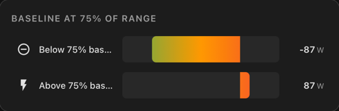


```yaml
type: custom:sensor-bar-card-plus
title: Midpoint Baseline
bar:
  fill_style: gradient
scale:
  min:
    fixed: -100
  max:
    fixed: 100
baseline:
  at: 50%
entities:
  - entity: sensor.power_flow
    name: Flow
```

### Baseline colors and overrides

The base semantic scale still spans the full bar. Optional above and below colors sit on top of that scale when you want the two directions to carry distinct meaning.

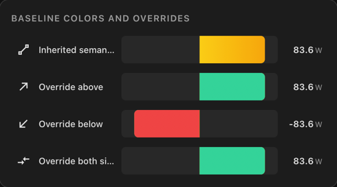

#### Above-baseline color only

```yaml
type: custom:sensor-bar-card-plus
title: Battery Bias
bar:
  fill_style: gradient
scale:
  min:
    fixed: -3200
  max:
    fixed: 3200
baseline:
  at:
    fixed: 0
  above:
    color: '#34d399'
entities:
  - entity: sensor.home_battery_power
    name: Battery
```

#### Above and below baseline colors

```yaml
type: custom:sensor-bar-card-plus
title: Bidirectional Override
bar:
  fill_style: gradient
scale:
  min:
    fixed: -3200
  max:
    fixed: 3200
baseline:
  at:
    fixed: 0
  above:
    color: '#34d399'
  below:
    color: '#ef4444'
entities:
  - entity: sensor.home_battery_power
    name: Battery
```

### Target and baseline interaction

Targets stay on the same global scale, so threshold markers, `target.when_exceeded.fill_color`, and baseline geometry remain easy to read together.

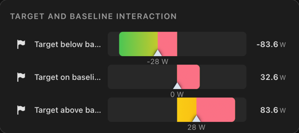

```yaml
type: custom:sensor-bar-card-plus
title: Target And Baseline Interaction
bar:
  fill_style: band_gradient
  segments:
    - from: 0%
      to: 30%
      color: '#22c55e'
    - from: 30%
      to: 70%
      color: '#facc15'
    - from: 70%
      to: 100%
      color: '#ef4444'
scale:
  min:
    fixed: -100
  max:
    fixed: 100
target:
  label:
    show: true
  when_exceeded:
    fill_color: '#fb7185'
baseline:
  at:
    fixed: 0
entities:
  - entity: sensor.power_flow
    name: Target above baseline
    target:
      at:
        fixed: 28
```

### Animated semantic baseline

Animated baseline rows keep the semantic color scale stable while the visible interval moves. That makes baseline crossing, threshold transitions, and bidirectional motion much easier to read.

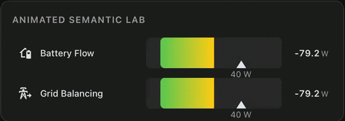

### Dynamic baseline

If both an `entity` and a `fixed` value are set under `baseline.at`, the entity takes precedence. If that entity is unavailable or non-numeric, the `fixed` value is used as fallback.

```yaml
type: custom:sensor-bar-card-plus
title: Dynamic baseline
bar:
  fill_style: gradient
scale:
  min:
    fixed: -3000
  max:
    fixed: 3000
baseline:
  at:
    entity: sensor.dynamic_baseline
    fixed: 0
entities:
  - entity: sensor.grid_power
    name: Grid
```

### Compact baseline layouts

Baseline also works well in denser dashboard layouts where you still want bidirectional meaning without giving up readability.


## Dynamic Min / Max / Target

You can source `scale.min`, `scale.max`, and `target.at` from other entities instead of hardcoding them in the card config.

This is especially useful when the scale and threshold are driven by other helpers, automations, or template sensors.

Why dynamic sources matter: the card can follow real Home Assistant entities for scale and target context instead of baking those values into YAML. That makes the visualization adapt naturally to batteries, grid limits, quotas, thresholds, changing operating modes, and dashboards where the meaning of "full", "safe", or "on target" changes over time.

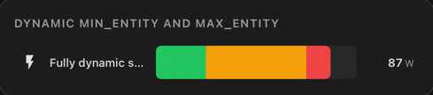

### Dynamic `scale.min` and `scale.max`

```yaml
type: custom:sensor-bar-card-plus
title: Dynamic min and max
bar:
  fill_style: gradient
scale:
  min:
    entity: sensor.dynamic_min
  max:
    entity: sensor.dynamic_max
entities:
  - entity: sensor.live_value
    name: Fully dynamic scale
```

This makes the full bar scale adaptive. The current value stays the same entity, but the visible scale can expand or contract around it.

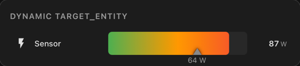

### Dynamic `target.at.entity`

For a moving threshold, use `target.at.entity`. This is useful for projected limits, tariff boundaries, ramping goals, or automation-driven targets.

```yaml
type: custom:sensor-bar-card-plus
title: Dynamic target
bar:
  fill_style: gradient
target:
  at:
    entity: sensor.power_target
  label:
    show: true
entities:
  - entity: sensor.power_usage
    name: Sensor
```

### Percentage target

```yaml
type: custom:sensor-bar-card-plus
title: Percentage target
scale:
  min:
    fixed: -100
  max:
    fixed: 100
target:
  at: 50%
entities:
  - entity: sensor.power_usage
    name: Sensor
```


If both a fixed value and an entity are configured, the entity takes precedence. If the entity is unavailable or non-numeric, the fixed value is used as fallback.

## Formatting, Text States, And Units

The card handles four related display concerns:

- decimal precision
- unit override
- tight time units like `43s` or `4h`
- textual states such as `unknown`, `unavailable`, and custom text pass-through

### Decimal Precision

Use `formatting.decimal` to control how many decimal places are shown per row.

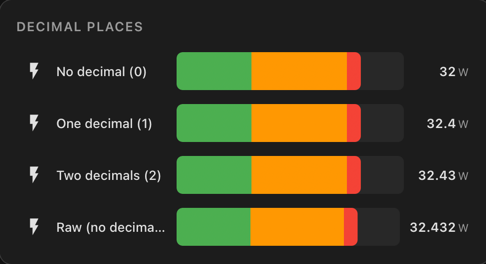

```yaml
type: custom:sensor-bar-card-plus
title: Decimal Places
layout:
  label:
    position: left
    width: 160
scale:
  min:
    fixed: 0
  max:
    fixed: 40
entities:
  - entity: sensor.temperature
    name: No decimal (0)
    formatting:
      decimal: 0
  - entity: sensor.temperature
    name: One decimal (1)
    formatting:
      decimal: 1
  - entity: sensor.temperature
    name: Two decimals (2)
    formatting:
      decimal: 2
  - entity: sensor.temperature
    name: Raw (no decimal set)
```

### Unit Override

By default the card displays the entity's unit of measurement. Use `formatting.unit` to override that when you want a shorter, normalized, or more readable display unit.

```yaml
type: custom:sensor-bar-card-plus
entities:
  - entity: sensor.solar_power
    name: Solar
    formatting:
      unit: W
  - entity: sensor.daily_energy
    name: Today
    formatting:
      unit: kWh
```

### Tight Time Units

Time units `h`, `m`, and `s` render tight, for example `43s` and `4h`, instead of showing an extra space.

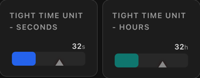

```yaml
type: custom:sensor-bar-card-plus
title: Tight Time Unit - Seconds
bar:
  fill_style: solid
  color: '#2563eb'
scale:
  min:
    fixed: 0
  max:
    fixed: 60
entities:
  - entity: sensor.response_time
    name: Response time
    formatting:
      unit: s
```

### Text States

Non-numeric current states are handled as first-class display states rather than treated like broken numeric rows.

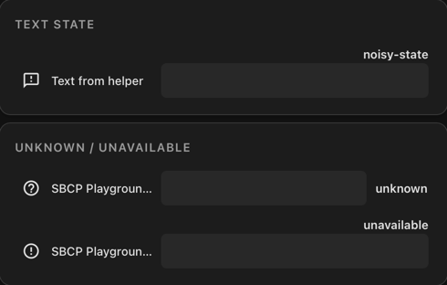

```yaml
type: custom:sensor-bar-card-plus
title: Unknown And Unavailable
bar:
  fill_style: bands
  segments:
    - from: 0%
      to: 50%
      color: '#22c55e'
    - from: 50%
      to: 100%
      color: '#ef4444'
layout:
  label:
    position: left
entities:
  - entity: sensor.status_unknown
    name: Unknown
  - entity: sensor.status_unavailable
    name: Unavailable
```

## Clicking A Bar

Clicking any row opens Home Assistant's native more-info dialog for that entity, including history and attributes.

No extra configuration is required.

## Error Handling

If an entity is missing, unavailable to the card, or misconfigured, the card renders an inline row-level error instead of crashing the whole card.

Other rows continue to render normally.

## Bar Height Variations

Use `layout.height` globally or per entity to make rows more compact or more prominent.

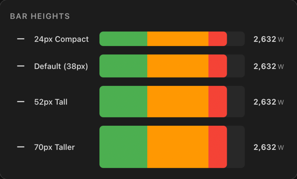

```yaml
type: custom:sensor-bar-card-plus
title: Bar Heights
layout:
  label:
    position: left
  height: 38
scale:
  max:
    fixed: 3000
entities:
  - entity: sensor.power_usage
    name: 24px Compact
    icon: mdi:minus
    layout:
      height: 24
  - entity: sensor.power_usage
    name: Default (38px)
    icon: mdi:minus
  - entity: sensor.power_usage
    name: 52px Tall
    icon: mdi:minus
    layout:
      height: 52
  - entity: sensor.power_usage
    name: 70px Taller
    icon: mdi:minus
    layout:
      height: 70
```

## Per-Entity Overrides

Every card-level option can be overridden per entity.

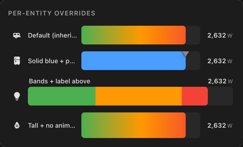

```yaml
type: custom:sensor-bar-card-plus
title: Mixed Overrides
layout:
  label:
    position: left
bar:
  fill_style: gradient
scale:
  min:
    fixed: 0
  max:
    fixed: 3000
entities:
  - entity: sensor.caravan_power
    name: Caravan
    icon: mdi:caravan

  - entity: sensor.fridge_power
    name: Fridge
    icon: mdi:fridge
    bar:
      fill_style: solid
      color: '#2563eb'
    scale:
      max:
        fixed: 2000
    peak:
      enabled: true

  - entity: sensor.lighting_power
    name: Lighting
    icon: mdi:lightbulb
    layout:
      label:
        position: above
    scale:
      max:
        fixed: 1000
    bar:
      fill_style: bands
      segments:
        - from: 0%
          to: 40%
          color: '#22c55e'
        - from: 40%
          to: 75%
          color: '#f59e0b'
        - from: 75%
          to: 100%
          color: '#ef4444'
```

# Configuration Reference

This appendix is the quick-reference guide for the currently supported Sensor Bar Card Plus configuration model. Structured syntax is preferred for new dashboards. Legacy flat syntax remains supported for backward compatibility.

## Card-Level Options

| Option | Type | Default | Description |
|---|---|---|---|
| `title` | string | `—` | Optional Lovelace card title |
| `entity` | string | `—` | Single-entity shorthand, normalized into `entities` |
| `entities` | list | required | Rows to render |
| `layout` | object | see below | Default layout for all rows |
| `scale` | object | `min: 0`, `max: 100` | Default scale for all rows |
| `bar` | object | see below | Default fill, marker, and animation settings |
| `baseline` | number/object | disabled | Default baseline / fill origin, including legacy fixed shorthand |
| `target` | number/object | disabled | Default target marker, including legacy fixed shorthand |
| `peak` | object | disabled | Default structured peak marker config |
| `formatting` | object | `decimal: null`, `unit: null` | Default numeric formatting |
| `label_position` | string | `left` | Legacy alias for `layout.label.position` |
| `label_width` | number | `100` | Legacy alias for `layout.label.width` |
| `height` | number | `38` | Legacy alias for `layout.height`; rendered minimum is `24` |
| `min` | number | `0` | Legacy alias for `scale.min.fixed` |
| `min_entity` | string | `null` | Legacy alias for `scale.min.entity` |
| `max` | number | `100` | Legacy alias for `scale.max.fixed` |
| `max_entity` | string | `null` | Legacy alias for `scale.max.entity` |
| `fill_style` | string | `bands` (legacy compatibility default) | Legacy flat alias for `bar.fill_style` |
| `color_mode` | string | `severity` | Legacy compatibility alias for `bar.color_mode` |
| `color` | string | `#4a9eff` | Legacy flat alias for `bar.color` |
| `gradient_stops` | list | `null` | Legacy flat alias for `bar.gradient_stops` |
| `segments` | list | `null` | Top-level structured alias for `bar.segments` |
| `severity` | list | default 3-band scale | Legacy severity array, normalized into `bar.segments` |
| `animated` | boolean | `true` | Legacy flat alias for `bar.animated` |
| `target_entity` | string | `null` | Legacy alias for `target.at.entity` |
| `target_color` | string | `#888` | Legacy alias for `target.color` |
| `show_target_label` | boolean | `false` | Legacy alias for `target.label.show` |
| `above_target_color` | string | `null` | Legacy alias for `target.when_exceeded.fill_color` |
| `show_peak` | boolean | `false` | Legacy alias for `peak.enabled` |
| `peak_color` | string | `#888` | Legacy alias for `peak.color` |
| `decimal` | number | `null` | Legacy alias for `formatting.decimal` |
| `unit` | string | `null` | Legacy alias for `formatting.unit` |

## Entity-Level Options

| Option | Type | Description |
|---|---|---|
| `entity` | string | Home Assistant entity id for the row |
| `name` | string | Row label override |
| `icon` | string | Row icon override |
| `layout` | object | Per-row layout override |
| `scale` | object | Per-row scale override |
| `bar` | object | Per-row fill and needle override |
| `target` | object/number | Per-row target override |
| `peak` | object | Per-row peak override |
| `baseline` | object/number/null | Per-row baseline override or explicit disable |
| `formatting` | object | Per-row decimal and unit override |
| `label_position` | string | Legacy alias for `layout.label.position` |
| `label_width` | number | Legacy alias for `layout.label.width` |
| `height` | number | Legacy alias for `layout.height` |
| `min` / `min_entity` | number / string | Legacy aliases for `scale.min` |
| `max` / `max_entity` | number / string | Legacy aliases for `scale.max` |
| `fill_style` / `color_mode` | string | Legacy flat aliases for `bar` mode selection |
| `color` | string | Legacy flat alias for `bar.color` |
| `gradient_stops` | list | Legacy flat alias for `bar.gradient_stops` |
| `segments` / `severity` | list | Per-row segment definitions |
| `animated` | boolean | Legacy flat alias for `bar.animated` |
| `target_entity`, `target_color`, `show_target_label`, `above_target_color` | mixed | Legacy target overrides |
| `show_peak`, `peak_color` | mixed | Legacy peak overrides |
| `decimal`, `unit` | mixed | Legacy formatting overrides |

## Structured Configuration

```yaml
layout:
  label:
    position: left
    width: 160
  height: 38

scale:
  min:
    fixed: 0
  max:
    entity: sensor.dynamic_max

bar:
  fill_style: soft_bands
  segment_space: percent
  color: '#2563eb'
  solid_fill: false
  animated: true
  gradient_stops:
    - pos: 0
      color: '#2563eb'
    - pos: 100%
      color: '#ef4444'
  segments:
    - from: 0%
      to: 50%
      color: '#22c55e'
    - from: 50%
      to: 100%
      color: '#ef4444'
  needle:
    show: true
    color: '#ffffff'

baseline:
  at:
    fixed: 0
  above:
    color: '#34d399'
  below:
    color: '#ef4444'

target:
  at:
    entity: sensor.power_target
    fixed: 2000
  color: '#dbe4ee'
  label:
    show: true
  when_exceeded:
    fill_color: '#ef4444'

peak:
  enabled: true
  color: '#fde68a'

formatting:
  decimal: 1
  unit: kW
```

Notes:

- `bar.segment_space` supports `percent` and `scale`
- `bar.gradient_stops[].pos` accepts both numeric values like `50` and percentage strings like `50%`

## Fill Styles

| `fill_style` | Description |
|---|---|
| `solid` | One solid fill color; best for simple status or branded accents |
| `gradient` | Continuous gradient from `bar.gradient_stops` |
| `bands` | Hard segment transitions using `bar.segments` |
| `soft_bands` | Segment-based colors with short blended transitions at eligible boundaries |
| `band_gradient` | Continuous interpolation across segment colors on the active scale |

For backwards compatibility with the original Sensor Bar Card, `bands` remains the implicit default fill style when no explicit style is configured. It is what it is.

## Needle

Simple form:

```yaml
bar:
  needle: true
```

Expanded form:

```yaml
bar:
  needle:
    show: true
    color: '#ffffff'
```

Notes:

- `bar.needle: true` is the preferred simple syntax
- `bar.needle.show` explicitly enables or disables the needle in structured form
- `bar.needle.color` sets the needle body and glow color
- the bar switches to full-scale paint mode when the needle is shown
- the current value is represented by the needle position
- the needle works with `solid`, `gradient`, `bands`, `soft_bands`, `band_gradient`, and `solid_fill`
- the needle is disabled automatically when a baseline is active

## Baseline

Fixed baseline:

```yaml
baseline:
  at:
    fixed: 0
```

Entity baseline:

```yaml
baseline:
  at:
    entity: sensor.dynamic_baseline
    fixed: 0
```

Percentage baseline:

```yaml
baseline:
  at: 50%
```

Bidirectional fill starts from `baseline.at` instead of always starting at `scale.min`. Optional `baseline.above.color` and `baseline.below.color` can semantically style each side.

## Target Marker

Simple fixed target:

```yaml
target: 65
```

Structured fixed target:

```yaml
target:
  at:
    fixed: 65
  color: '#dbe4ee'
  label:
    show: true
```

Structured entity target:

```yaml
target:
  at:
    entity: sensor.dynamic_target
    fixed: 65
```

Percentage target:

```yaml
target:
  at: 50%
```

Supported target features:

- fixed target values
- entity-backed target values
- percentage targets on the active scale
- optional marker color
- optional target value label
- optional `target.when_exceeded.fill_color`

## Peak Marker

```yaml
peak:
  enabled: true
  color: '#fde68a'
```

The peak marker tracks the highest observed value for the current page session.

## Formatting

```yaml
formatting:
  decimal: 1
  unit: kW
```

- `formatting.decimal` applies to displayed numeric values
- `formatting.unit` overrides the entity unit


## Behavior Notes

- Clicking a row opens the native Home Assistant more-info dialog.
- Peak values are stored in memory and reset when the page reloads.
- Textual states do not show leftover units.
- Time units `h`, `m`, and `s` render tight, for example `43s` and `4h`.
- Responsive fallbacks prioritize the bar and keep value + unit readable. In tight spaces, labels and icons may step aside automatically.

## Legacy Compatibility / Migration

Legacy syntax remains fully supported for backward compatibility.

| Legacy | Modern Equivalent |
|---|---|
| `color_mode: single` | `bar.fill_style: solid` |
| `color_mode: gradient` | `bar.fill_style: gradient` |
| `color_mode: severity` | `bar.fill_style: bands` |
| `color_mode: severity_gradient` | `bar.fill_style: band_gradient` |
| `label_position` | `layout.label.position` |
| `label_width` | `layout.label.width` |
| `height` | `layout.height` |
| `min` / `min_entity` | `scale.min.fixed` / `scale.min.entity` |
| `max` / `max_entity` | `scale.max.fixed` / `scale.max.entity` |
| `target` / `target_entity` | `target.at.fixed` / `target.at.entity` |
| `target_color` | `target.color` |
| `show_target_label` | `target.label.show` |
| `above_target_color` | `target.when_exceeded.fill_color` |
| `show_peak` / `peak_color` | `peak.enabled` / `peak.color` |
| `decimal` / `unit` | `formatting.decimal` / `formatting.unit` |
| `severity` | `bar.segments` using `%` values when migrating legacy bands |

### Migrating From The Original Card

Install this card side by side, then update:

- resource URL from the original file to `/local/sensor-bar-card-plus.js`
- card type from `custom:sensor-bar-card` to `custom:sensor-bar-card-plus`

### Migrating From Legacy Flat YAML

You do not need to migrate existing dashboards immediately. For new dashboards, the structured model is recommended because related options stay grouped and the configuration scales better as cards become more advanced.

| Legacy flat key | Structured equivalent |
|---|---|
| `label_position` | `layout.label.position` |
| `label_width` | `layout.label.width` |
| `height` | `layout.height` |
| `min` | `scale.min.fixed` |
| `min_entity` | `scale.min.entity` |
| `max` | `scale.max.fixed` |
| `max_entity` | `scale.max.entity` |
| `decimal` | `formatting.decimal` |
| `unit` | `formatting.unit` |
| `target` | `target.at.fixed` or `target.at: 50%` |
| `target_entity` | `target.at.entity` |
| `target_color` | `target.color` |
| `show_target_label` | `target.label.show` |
| `above_target_color` | `target.when_exceeded.fill_color` |
| `show_peak` | `peak.enabled` |
| `peak_color` | `peak.color` |
| `color_mode` | `bar.color_mode` (compatibility) |
| `fill_style` | `bar.fill_style` (preferred structured syntax) |
| `color` | `bar.color` |
| `gradient_stops` | `bar.gradient_stops` |
| `severity` | `bar.segments` with percentage values, for example `from: 50%` |
| `segments` | `bar.segments` |
| `animated` | `bar.animated` |
| `baseline` | `baseline.at.fixed`, `baseline.at.entity`, or `baseline.at: 50%` |

Legacy:

```yaml
type: custom:sensor-bar-card-plus
title: Legacy Example
label_position: left
label_width: 150
min: 0
max: 100
color_mode: severity
target: 65
show_target_label: true
severity:
  - from: 0
    to: 50
    color: '#22c55e'
  - from: 50
    to: 100
    color: '#ef4444'
entities:
  - entity: sensor.power_usage
    name: Power
```

Structured:

```yaml
type: custom:sensor-bar-card-plus
title: Structured Example
layout:
  label:
    position: left
    width: 150
scale:
  min:
    fixed: 0
  max:
    fixed: 100
bar:
  fill_style: bands
  segments:
    - from: 0%
      to: 50%
      color: '#22c55e'
    - from: 50%
      to: 100%
      color: '#ef4444'
target:
  at:
    fixed: 65
  label:
    show: true
entities:
  - entity: sensor.power_usage
    name: Power
```

When migrating legacy `severity`, remember that legacy band numbers are percentages of the active scale. Structured `bar.segments` should therefore usually use `%` values during migration. Plain numeric segment boundaries are actual scale values.

`bar.fill_style` is now the preferred structured syntax for new dashboards. Existing `bar.color_mode` remains fully supported for compatibility and renders identically.

For a full visual comparison, see `examples/dashboards/sensor-bar-card-plus-heritage.yaml`.

### Automatic Dashboard Migration

Existing dashboards do not need to be migrated. Legacy flat YAML remains fully supported. This utility is available if you want to adopt the structured configuration model for an existing Lovelace dashboard.

```bash
python tools/convert-legacy-config.py dashboard.yaml > dashboard-structured.yaml
```

```bash
python tools/convert-legacy-config.py dashboard.yaml dashboard-structured.yaml
```

```bash
cat dashboard.yaml | python tools/convert-legacy-config.py > dashboard-structured.yaml
```

The converter only rewrites Sensor Bar Card Plus cards. All other Lovelace cards, custom cards, `card_mod` configuration, and unrelated YAML are left unchanged.

It traverses dashboards recursively, so nested Sensor Bar Card Plus cards are converted even when they appear inside wrapper cards or more complex dashboard structures.

The conversion is deterministic and follows the same migration rules used by the Heritage Dashboard examples.


## Demo Assets / Development

The repository includes a full demo playground and a dedicated screenshot board:

- playground dashboard: `examples/dashboards/sensor-bar-card-plus-playground.yaml`
- heritage parity dashboard: `examples/dashboards/sensor-bar-card-plus-heritage.yaml`
- screenshot dashboard: `examples/dashboards/sensor-bar-card-plus-screenshots.yaml`
- helper/template package: `examples/packages/sensor_bar_card_plus_playground_package.yaml`

Use them to validate fill styles, markers, dynamic scales, text states, edge cases, and responsive behavior.

### Test Suite Usage

Install the dev dependencies and Playwright browser once:

```bash
npm install
npx playwright install chromium
```

Run the pure logic unit tests:

```bash
npm run test:unit
```

Run the Playwright visual regression suite:

```bash
npm run test:visual
```

Update the stored visual snapshots intentionally after a reviewed visual change:

```bash
npm run test:visual:update
```

`npm test` runs the unit suite first and then the visual regression suite.

The visual regression suite covers baseline rendering, fill styles, target and peak markers, compact layouts, and clipping or rounded-edge regressions.


## Project Origin

Sensor Bar Card Plus was originally inspired by Sensor Bar Card by TommySharpNZ. The original project is here:

<https://github.com/TommySharpNZ/sensor-bar-card>

This project uses its own resource path and card type so both cards can coexist safely in the same Home Assistant installation:

- original card type: `custom:sensor-bar-card`
- this card type: `custom:sensor-bar-card-plus`
- this resource path: `/local/sensor-bar-card-plus.js`

It is not a drop-in replacement for the original card.


## Future Directions

Likely future work includes:

- visible `scale.ticks` support under `scale`
- a more general marker collection once the current target and peak semantics are stable
- verticality, baby!

## Contributing

Issues and pull requests are welcome.

Recommended workflow:

1. Make changes in `src/sensor-bar-card-plus.js`
2. Verify behavior in the demo playground and screenshot board
3. Update screenshots or README examples if the user-facing behavior changed
4. Open a pull request with a concise explanation of the change

## Support Me

If `sensor-bar-card-plus` improves your Home Assistant dashboard, you can support continued development, maintenance, fixes, documentation, and new features.

[](https://ko-fi.com/chrisdelaet)

## License

[MIT](LICENSE)
